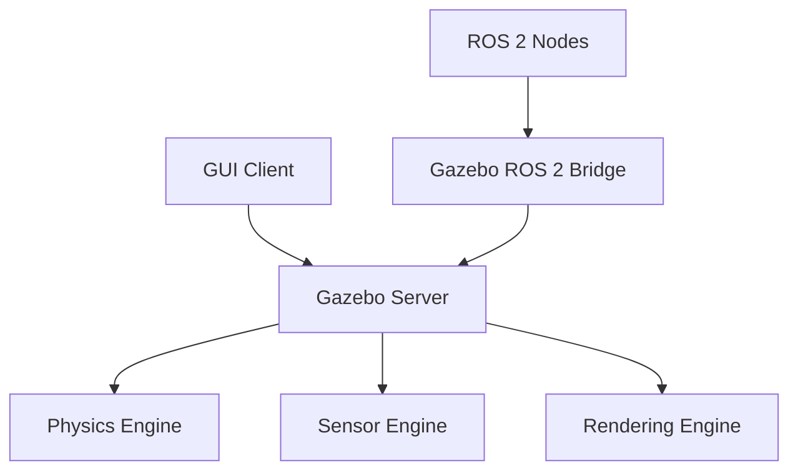

# Environment and Robot Simulation using Gazebo: Physics-Based Digital Twins

## Overview

Gazebo stands as one of the most widely adopted physics-based simulation environments in robotics, providing realistic simulation capabilities for both robots and their environments. In the context of Physical AI and humanoid robotics, Gazebo enables the creation of sophisticated digital twins that accurately model robot kinematics, dynamics, sensor systems, and environmental interactions. This simulation environment serves as a critical bridge between theoretical AI models and embodied physical systems, allowing for safe, cost-effective development and testing of complex robotic behaviors.

Gazebo's integration with ROS 2 through Gazebo ROS 2 packages enables seamless workflows where simulation models can be developed, tested, and validated before deployment on physical robots. The platform's robust physics engine, diverse sensor models, and flexible environment creation tools make it particularly suitable for humanoid robotics applications where safety, complexity, and multi-modal interaction are paramount.

## Learning Objectives

By the end of this section, you should be able to:
- Create realistic robot models for simulation in Gazebo
- Design complex environments with appropriate physics properties
- Configure sensors and actuators for simulation
- Integrate Gazebo with ROS 2 for seamless simulation workflows

## Introduction to Gazebo

### What is Gazebo?

**Gazebo** is a physics-based simulation environment that provides realistic simulation of robots and their environments. Originally developed by the Open Source Robotics Foundation (OSRF), Gazebo has become the de facto standard for robotics simulation, offering:

- **High-fidelity physics simulation** using ODE, Bullet, or DART physics engines
- **Realistic sensor simulation** including cameras, LiDAR, IMUs, and force/torque sensors
- **Flexible environment modeling** with support for complex scenes and dynamic objects
- **ROS integration** for seamless communication with robotic applications
- **Plugin architecture** for extending functionality

### Gazebo Architecture

Gazebo follows a client-server architecture:



The architecture consists of:
- **Gazebo Server**: Core simulation engine handling physics, sensors, and rendering
- **GUI Client**: Visualization and interaction interface
- **Gazebo ROS 2 Bridge**: Communication layer between Gazebo and ROS 2
- **Physics Engine**: ODE, Bullet, or DART for physics simulation
- **Sensor Engine**: Realistic sensor simulation
- **Rendering Engine**: 3D visualization and graphics

## Setting Up Gazebo with ROS 2

### Installation and Configuration

Gazebo integration with ROS 2 requires specific packages:

```bash
# Install Gazebo with ROS 2 support
sudo apt install ros-humble-gazebo-ros-pkgs
sudo apt install ros-humble-gazebo-ros2-control
sudo apt install ros-humble-gazebo-dev

# Verify installation
gz --version
```

### Basic Gazebo Launch

```python
# launch/gazebo_simulation.py
from launch import LaunchDescription
from launch.actions import DeclareLaunchArgument, IncludeLaunchDescription
from launch.launch_description_sources import PythonLaunchDescriptionSource
from launch.substitutions import LaunchConfiguration, PathJoinSubstitution
from launch_ros.substitutions import FindPackageShare
from launch_ros.actions import Node

def generate_launch_description():
    # Declare launch arguments
    world_arg = DeclareLaunchArgument(
        'world',
        default_value='empty.sdf',
        description='Choose one of the world files from `/gazebo_worlds`'
    )

    # Launch Gazebo server
    gzserver = IncludeLaunchDescription(
        PythonLaunchDescriptionSource([
            PathJoinSubstitution([
                FindPackageShare('gazebo_ros'),
                'launch',
                'gzserver.launch.py'
            ])
        ]),
        launch_arguments={
            'world': LaunchConfiguration('world'),
            'verbose': 'false'
        }.items()
    )

    # Launch Gazebo client
    gzclient = IncludeLaunchDescription(
        PythonLaunchDescriptionSource([
            PathJoinSubstitution([
                FindPackageShare('gazebo_ros'),
                'launch',
                'gzclient.launch.py'
            ])
        ])
    )

    return LaunchDescription([
        world_arg,
        gzserver,
        gzclient
    ])
```

## Robot Modeling for Gazebo

### URDF to SDF Conversion

Gazebo primarily uses SDF (Simulation Description Format), but can work with URDF:

```xml
<!-- Example: Adding Gazebo-specific elements to URDF -->
<robot name="humanoid_robot">
  <!-- Standard URDF content -->
  <link name="base_link">
    <inertial>
      <mass value="10.0"/>
      <origin xyz="0 0 0.5" rpy="0 0 0"/>
      <inertia ixx="1.0" ixy="0" ixz="0" iyy="1.0" iyz="0" izz="1.0"/>
    </inertial>
    <visual>
      <origin xyz="0 0 0.5" rpy="0 0 0"/>
      <geometry>
        <box size="0.3 0.3 1.0"/>
      </geometry>
      <material name="gray">
        <color rgba="0.5 0.5 0.5 1"/>
      </material>
    </visual>
    <collision>
      <origin xyz="0 0 0.5" rpy="0 0 0"/>
      <geometry>
        <box size="0.3 0.3 1.0"/>
      </geometry>
    </collision>
  </link>

  <!-- Gazebo-specific elements -->
  <gazebo reference="base_link">
    <material>Gazebo/Gray</material>
    <mu1>0.2</mu1>
    <mu2>0.2</mu2>
    <kp>1000000.0</kp>  <!-- Contact stiffness -->
    <kd>1.0</kd>        <!-- Contact damping -->
  </gazebo>

  <!-- Joint with actuator -->
  <joint name="hip_joint" type="revolute">
    <parent link="base_link"/>
    <child link="left_leg"/>
    <origin xyz="0 -0.1 0" rpy="0 0 0"/>
    <axis xyz="0 0 1"/>
    <limit lower="-1.57" upper="1.57" effort="200" velocity="2"/>
  </joint>

  <!-- Gazebo plugin for joint control -->
  <gazebo>
    <plugin filename="libgazebo_ros_joint_trajectory.so" name="joint_trajectory">
      <commandTopic>joint_trajectory</commandTopic>
      <stateTopic>joint_trajectory_states</stateTopic>
      <actionTopic>joint_trajectory_action</actionTopic>
    </plugin>
  </gazebo>
</robot>
```

### Gazebo-Specific Robot Description

For more advanced features, use SDF directly:

```xml
<?xml version="1.0"?>
<sdf version="1.7">
  <model name="humanoid_robot">
    <!-- Model properties -->
    <static>false</static>
    <self_collide>false</self_collide>

    <!-- Links -->
    <link name="base_link">
      <pose>0 0 1 0 0 0</pose>
      <inertial>
        <mass>10.0</mass>
        <inertia>
          <ixx>1.0</ixx>
          <ixy>0.0</ixy>
          <ixz>0.0</ixz>
          <iyy>1.0</iyy>
          <iyz>0.0</iyz>
          <izz>1.0</izz>
        </inertia>
      </inertial>

      <!-- Visual -->
      <visual name="visual">
        <geometry>
          <box>
            <size>0.3 0.3 1.0</size>
          </box>
        </geometry>
        <material>
          <ambient>0.5 0.5 0.5 1</ambient>
          <diffuse>0.5 0.5 0.5 1</diffuse>
          <specular>0.1 0.1 0.1 1</specular>
        </material>
      </visual>

      <!-- Collision -->
      <collision name="collision">
        <geometry>
          <box>
            <size>0.3 0.3 1.0</size>
          </box>
        </geometry>
        <surface>
          <friction>
            <ode>
              <mu>0.2</mu>
              <mu2>0.2</mu2>
            </ode>
          </friction>
          <contact>
            <ode>
              <kp>1000000.0</kp>
              <kd>1.0</kd>
            </ode>
          </contact>
        </surface>
      </collision>
    </link>

    <!-- Joint -->
    <joint name="hip_joint" type="revolute">
      <parent>base_link</parent>
      <child>left_leg</child>
      <pose>0 -0.1 0 0 0 0</pose>
      <axis>
        <xyz>0 0 1</xyz>
        <limit>
          <lower>-1.57</lower>
          <upper>1.57</upper>
          <effort>200</effort>
          <velocity>2</velocity>
        </limit>
      </axis>
    </joint>
  </model>
</sdf>
```

## Environment Design in Gazebo

### Creating World Files

World files define the simulation environment:

```xml
<?xml version="1.0" ?>
<sdf version="1.7">
  <world name="humanoid_world">
    <!-- Physics engine configuration -->
    <physics type="ode">
      <max_step_size>0.001</max_step_size>
      <real_time_factor>1.0</real_time_factor>
      <real_time_update_rate>1000</real_time_update_rate>
      <gravity>0 0 -9.8</gravity>
    </physics>

    <!-- GUI configuration -->
    <gui fullscreen="0">
      <camera name="user_camera">
        <pose>-5 -5 3 0 0.4 1.5708</pose>
        <view_controller>orbit</view_controller>
        <projection_type>perspective</projection_type>
      </camera>
    </gui>

    <!-- Light sources -->
    <light name="sun" type="directional">
      <cast_shadows>true</cast_shadows>
      <pose>0 0 10 0 0 0</pose>
      <diffuse>0.8 0.8 0.8 1</diffuse>
      <specular>0.2 0.2 0.2 1</specular>
      <attenuation>
        <range>1000</range>
        <constant>0.9</constant>
        <linear>0.01</linear>
        <quadratic>0.001</quadratic>
      </attenuation>
      <direction>-0.3 0.3 -1</direction>
    </light>

    <!-- Ground plane -->
    <include>
      <uri>model://ground_plane</uri>
    </include>

    <!-- Sky -->
    <include>
      <uri>model://sky</uri>
    </include>

    <!-- Robot model -->
    <include>
      <uri>model://humanoid_robot</uri>
      <pose>0 0 1.0 0 0 0</pose>
    </include>

    <!-- Environment objects -->
    <model name="table">
      <pose>2 0 0 0 0 0</pose>
      <link name="table_base">
        <collision name="collision">
          <geometry>
            <box>
              <size>1.0 0.8 0.8</size>
            </box>
          </geometry>
        </collision>
        <visual name="visual">
          <geometry>
            <box>
              <size>1.0 0.8 0.8</size>
            </box>
          </geometry>
          <material>
            <ambient>0.8 0.6 0.2 1</ambient>
            <diffuse>0.8 0.6 0.2 1</diffuse>
          </material>
        </visual>
        <inertial>
          <mass>50.0</mass>
          <inertia>
            <ixx>1.0</ixx>
            <ixy>0.0</ixy>
            <ixz>0.0</ixz>
            <iyy>1.0</iyy>
            <iyz>0.0</iyz>
            <izz>1.0</izz>
          </inertia>
        </inertial>
      </link>
    </model>

    <!-- Obstacles -->
    <model name="obstacle_1">
      <pose>1 1 0.5 0 0 0</pose>
      <static>true</static>
      <link name="obstacle_link">
        <collision name="collision">
          <geometry>
            <cylinder>
              <radius>0.2</radius>
              <length>1.0</length>
            </cylinder>
          </geometry>
        </collision>
        <visual name="visual">
          <geometry>
            <cylinder>
              <radius>0.2</radius>
              <length>1.0</length>
            </cylinder>
          </geometry>
          <material>
            <ambient>0.2 0.2 0.8 1</ambient>
            <diffuse>0.2 0.2 0.8 1</diffuse>
          </material>
        </visual>
      </link>
    </model>
  </world>
</sdf>
```

### Custom Environment Models

Creating custom environment models:

```xml
<!-- ~/.gazebo/models/my_room/model.sdf -->
<?xml version="1.0" ?>
<sdf version="1.7">
  <model name="my_room">
    <static>true</static>

    <!-- Room walls -->
    <link name="wall_front">
      <collision name="collision">
        <geometry>
          <box>
            <size>10 0.2 3</size>
          </box>
        </geometry>
      </collision>
      <visual name="visual">
        <geometry>
          <box>
            <size>10 0.2 3</size>
          </box>
        </geometry>
        <material>
          <ambient>0.8 0.8 0.8 1</ambient>
          <diffuse>0.8 0.8 0.8 1</diffuse>
        </material>
      </visual>
    </link>

    <link name="wall_back">
      <pose>0 5 1.5 0 0 0</pose>
      <collision name="collision">
        <geometry>
          <box>
            <size>10 0.2 3</size>
          </box>
        </geometry>
      </collision>
      <visual name="visual">
        <geometry>
          <box>
            <size>10 0.2 3</size>
          </box>
        </geometry>
        <material>
          <ambient>0.8 0.8 0.8 1</ambient>
          <diffuse>0.8 0.8 0.8 1</diffuse>
        </material>
      </visual>
    </link>

    <!-- Furniture -->
    <include>
      <uri>model://table</uri>
      <pose>2 2 0 0 0 0</pose>
    </include>

    <include>
      <uri>model://chair</uri>
      <pose>2.5 2.5 0 0 0 1.57</pose>
    </include>
  </model>
</sdf>

<!-- ~/.gazebo/models/my_room/model.config -->
<?xml version="1.0"?>
<model>
  <name>my_room</name>
  <version>1.0</version>
  <sdf version="1.7">model.sdf</sdf>
  <author>
    <name>Your Name</name>
    <email>your.email@example.com</email>
  </author>
  <description>
    A custom room environment for humanoid robot simulation.
  </description>
</model>
```

## Sensor Integration in Gazebo

### Camera Sensors

Configuring camera sensors for perception:

```xml
<gazebo reference="camera_link">
  <sensor name="camera" type="camera">
    <always_on>true</always_on>
    <update_rate>30</update_rate>
    <camera>
      <horizontal_fov>1.047</horizontal_fov> <!-- 60 degrees -->
      <image>
        <width>640</width>
        <height>480</height>
        <format>R8G8B8</format>
      </image>
      <clip>
        <near>0.1</near>
        <far>10.0</far>
      </clip>
      <noise>
        <type>gaussian</type>
        <mean>0.0</mean>
        <stddev>0.007</stddev>
      </noise>
    </camera>
    <visualize>true</visualize>
  </sensor>
</gazebo>
```

### LiDAR Sensors

Configuring LiDAR for 3D perception:

```xml
<gazebo reference="lidar_link">
  <sensor name="lidar" type="ray">
    <always_on>true</always_on>
    <update_rate>10</update_rate>
    <ray>
      <scan>
        <horizontal>
          <samples>720</samples>
          <resolution>1</resolution>
          <min_angle>-1.570796</min_angle> <!-- -90 degrees -->
          <max_angle>1.570796</max_angle>   <!-- 90 degrees -->
        </horizontal>
        <vertical>
          <samples>1</samples>
          <resolution>1</resolution>
          <min_angle>0</min_angle>
          <max_angle>0</max_angle>
        </vertical>
      </scan>
      <range>
        <min>0.1</min>
        <max>30.0</max>
        <resolution>0.01</resolution>
      </range>
    </ray>
    <plugin name="lidar_controller" filename="libgazebo_ros_ray_sensor.so">
      <ros>
        <namespace>/laser</namespace>
        <remapping>~/out:=scan</remapping>
      </ros>
      <output_type>sensor_msgs/LaserScan</output_type>
    </plugin>
  </sensor>
</gazebo>
```

### IMU Sensors

Configuring IMU for orientation and acceleration:

```xml
<gazebo reference="imu_link">
  <sensor name="imu_sensor" type="imu">
    <always_on>true</always_on>
    <update_rate>100</update_rate>
    <imu>
      <angular_velocity>
        <x>
          <noise type="gaussian">
            <mean>0.0</mean>
            <stddev>2e-4</stddev>
            <bias_mean>0.0000075</bias_mean>
            <bias_stddev>0.0000008</bias_stddev>
          </noise>
        </x>
        <y>
          <noise type="gaussian">
            <mean>0.0</mean>
            <stddev>2e-4</stddev>
            <bias_mean>0.0000075</bias_mean>
            <bias_stddev>0.0000008</bias_stddev>
          </noise>
        </y>
        <z>
          <noise type="gaussian">
            <mean>0.0</mean>
            <stddev>2e-4</stddev>
            <bias_mean>0.0000075</bias_mean>
            <bias_stddev>0.0000008</bias_stddev>
          </noise>
        </z>
      </angular_velocity>
      <linear_acceleration>
        <x>
          <noise type="gaussian">
            <mean>0.0</mean>
            <stddev>1.7e-2</stddev>
            <bias_mean>0.017</bias_mean>
            <bias_stddev>0.0017</bias_stddev>
          </noise>
        </x>
        <y>
          <noise type="gaussian">
            <mean>0.0</mean>
            <stddev>1.7e-2</stddev>
            <bias_mean>0.017</bias_mean>
            <bias_stddev>0.0017</bias_stddev>
          </noise>
        </y>
        <z>
          <noise type="gaussian">
            <mean>0.0</mean>
            <stddev>1.7e-2</stddev>
            <bias_mean>0.017</bias_mean>
            <bias_stddev>0.0017</bias_stddev>
          </noise>
        </z>
      </linear_acceleration>
    </imu>
  </sensor>
</gazebo>
```

## Control Integration with ROS 2

### Joint Control Plugins

Integrating joint control with ROS 2:

```xml
<!-- Using ros2_control for joint control -->
<gazebo>
  <plugin filename="libgazebo_ros2_control.so" name="gazebo_ros2_control">
    <parameters>$(find my_robot_description)/config/robot_control.yaml</parameters>
  </plugin>
</gazebo>
```

```yaml
# config/robot_control.yaml
controller_manager:
  ros__parameters:
    update_rate: 1000  # Hz

    joint_state_broadcaster:
      type: joint_state_broadcaster/JointStateBroadcaster

    # Position controllers
    left_hip_position_controller:
      type: position_controllers/JointGroupPositionController

    right_hip_position_controller:
      type: position_controllers/JointGroupPositionController

    # Effort controllers for more dynamic control
    torso_effort_controller:
      type: effort_controllers/JointGroupEffortController

# Joint group definitions
left_hip_position_controller:
  ros__parameters:
    joints:
      - left_hip_yaw
      - left_hip_pitch
      - left_hip_roll

right_hip_position_controller:
  ros__parameters:
    joints:
      - right_hip_yaw
      - right_hip_pitch
      - right_hip_roll
```

### Custom Control Plugins

Creating custom control plugins for specialized behavior:

```cpp
// include/my_robot_gazebo/CustomControllerPlugin.hpp
#ifndef CUSTOM_CONTROLLER_PLUGIN_HPP
#define CUSTOM_CONTROLLER_PLUGIN_HPP

#include <gazebo/common/Plugin.hh>
#include <gazebo/physics/physics.hh>
#include <rclcpp/rclcpp.hpp>
#include <std_msgs/msg/float64_multi_array.hpp>
#include <sensor_msgs/msg/joint_state.hpp>

namespace gazebo
{
class CustomControllerPlugin : public ModelPlugin
{
public:
    void Load(physics::ModelPtr _model, sdf::ElementPtr _sdf) override;
    void OnUpdate();

private:
    physics::ModelPtr model;
    physics::PhysicsEnginePtr physics;
    event::ConnectionPtr update_connection;

    // ROS 2 components
    rclcpp::Node::SharedPtr node;
    rclcpp::Subscription<std_msgs::msg::Float64MultiArray>::SharedPtr command_sub;
    rclcpp::Publisher<sensor_msgs::msg::JointState>::SharedPtr state_pub;

    std::vector<physics::JointPtr> joints;
    std::vector<double> joint_positions;
    std::vector<double> joint_velocities;
    std::vector<double> joint_efforts;
    std::vector<double> target_positions;

    void CommandCallback(const std_msgs::msg::Float64MultiArray::SharedPtr msg);
    void PublishState();
};
}

#endif
```

```cpp
// src/CustomControllerPlugin.cpp
#include "my_robot_gazebo/CustomControllerPlugin.hpp"

namespace gazebo
{
void CustomControllerPlugin::Load(physics::ModelPtr _model, sdf::ElementPtr _sdf)
{
    model = _model;
    physics = model->GetWorld()->Physics();

    // Initialize ROS 2
    if (!rclcpp::ok()) {
        rclcpp::init(0, nullptr);
    }

    // Create node
    node = rclcpp::Node::make_shared("gazebo_custom_controller");

    // Subscribe to commands
    command_sub = node->create_subscription<std_msgs::msg::Float64MultiArray>(
        "/joint_commands", 10,
        std::bind(&CustomControllerPlugin::CommandCallback, this, std::placeholders::_1)
    );

    // Publish joint states
    state_pub = node->create_publisher<sensor_msgs::msg::JointState>(
        "/joint_states", 10
    );

    // Get joints from model
    for (const auto& joint_name : {"joint1", "joint2", "joint3"}) {
        auto joint = model->GetJoint(joint_name);
        if (joint) {
            joints.push_back(joint);
            joint_positions.push_back(0.0);
            joint_velocities.push_back(0.0);
            joint_efforts.push_back(0.0);
            target_positions.push_back(0.0);
        }
    }

    // Connect to Gazebo update event
    update_connection = event::Events::ConnectWorldUpdateBegin(
        std::bind(&CustomControllerPlugin::OnUpdate, this)
    );
}

void CustomControllerPlugin::OnUpdate()
{
    // Update joint states
    for (size_t i = 0; i < joints.size(); ++i) {
        joint_positions[i] = joints[i]->Position(0);
        joint_velocities[i] = joints[i]->GetVelocity(0);
        joint_efforts[i] = joints[i]->GetForce(0);

        // Apply control law (simple PD controller example)
        double error = target_positions[i] - joint_positions[i];
        double vel_error = 0.0 - joint_velocities[i];

        double kp = 100.0;
        double kd = 10.0;

        double effort = kp * error + kd * vel_error;
        joints[i]->SetForce(0, effort);
    }

    // Publish state
    PublishState();

    // Spin ROS 2 node
    rclcpp::spin_some(node);
}

void CustomControllerPlugin::CommandCallback(const std_msgs::msg::Float64MultiArray::SharedPtr msg)
{
    if (msg->data.size() == target_positions.size()) {
        for (size_t i = 0; i < msg->data.size(); ++i) {
            target_positions[i] = msg->data[i];
        }
    }
}

void CustomControllerPlugin::PublishState()
{
    auto msg = sensor_msgs::msg::JointState();
    msg.header.stamp = node->now();
    msg.name.resize(joints.size());
    msg.position.resize(joints.size());
    msg.velocity.resize(joints.size());
    msg.effort.resize(joints.size());

    for (size_t i = 0; i < joints.size(); ++i) {
        msg.name[i] = joints[i]->GetName();
        msg.position[i] = joint_positions[i];
        msg.velocity[i] = joint_velocities[i];
        msg.effort[i] = joint_efforts[i];
    }

    state_pub->publish(msg);
}
}

GZ_REGISTER_MODEL_PLUGIN(gazebo::CustomControllerPlugin)
```

## Gazebo Simulation Best Practices

### Performance Optimization

```python
# Performance monitoring and optimization
class GazeboPerformanceMonitor:
    def __init__(self):
        self.simulation_rate = 1000  # Hz
        self.real_time_factor = 1.0
        self.update_times = []
        self.cpu_usage = []

    def monitor_performance(self):
        """Monitor and optimize Gazebo performance"""
        # Check simulation rate
        actual_rate = self.measure_simulation_rate()

        if actual_rate < 0.8 * self.simulation_rate:
            # Reduce physics complexity
            self.reduce_physics_complexity()

        # Monitor real-time factor
        if self.real_time_factor < 0.9:
            # Adjust time step
            self.adjust_time_step()

        # Monitor CPU usage
        if self.get_cpu_usage() > 80:
            # Reduce update rates
            self.reduce_update_rates()

    def reduce_physics_complexity(self):
        """Reduce physics simulation complexity"""
        # Simplify collision meshes
        # Reduce solver iterations
        # Use simpler contact models

    def adjust_time_step(self):
        """Adjust simulation time step"""
        # Increase time step for better performance
        # Decrease time step for better accuracy
        pass
```

### Physics Parameter Tuning

```python
class PhysicsParameterTuner:
    def __init__(self):
        self.default_params = {
            'time_step': 0.001,
            'max_step_size': 0.001,
            'real_time_factor': 1.0,
            'solver_type': 'ode',
            'solver_iterations': 100,
            'solver_sor': 1.0,
            'contact_surface_layer': 0.001,
            'contact_max_correcting_vel': 100.0
        }

    def tune_for_robot(self, robot_model):
        """Tune physics parameters for specific robot"""
        # Analyze robot characteristics
        mass_distribution = self.analyze_mass_distribution(robot_model)
        joint_constraints = self.analyze_joint_constraints(robot_model)

        # Adjust parameters based on analysis
        tuned_params = self.default_params.copy()

        # For heavy robots, may need smaller time steps
        if mass_distribution.max_mass > 50.0:  # kg
            tuned_params['time_step'] = 0.0005
            tuned_params['max_step_size'] = 0.0005

        # For robots with many constraints, increase solver iterations
        if joint_constraints.num_constraints > 20:
            tuned_params['solver_iterations'] = 200

        return tuned_params
```

## Advanced Gazebo Features

### Dynamic Environments

Creating dynamic environments with moving objects:

```xml
<!-- Dynamic obstacle that moves in a pattern -->
<model name="moving_obstacle">
  <link name="obstacle_link">
    <pose>0 0 0.5 0 0 0</pose>
    <inertial>
      <mass>1.0</mass>
      <inertia>
        <ixx>0.01</ixx>
        <ixy>0</ixy>
        <ixz>0</ixz>
        <iyy>0.01</iyy>
        <iyz>0</iyz>
        <izz>0.01</izz>
      </inertia>
    </inertial>
    <collision name="collision">
      <geometry>
        <sphere>
          <radius>0.2</radius>
        </sphere>
      </geometry>
    </collision>
    <visual name="visual">
      <geometry>
        <sphere>
          <radius>0.2</radius>
        </sphere>
      </geometry>
      <material>
        <ambient>1 0 0 1</ambient>
        <diffuse>1 0 0 1</diffuse>
      </material>
    </visual>
  </link>

  <!-- Plugin to move the obstacle -->
  <gazebo>
    <plugin name="moving_obstacle_plugin" filename="libMovingObstaclePlugin.so">
      <linear_velocity>0.2</linear_velocity>
      <angular_velocity>0.5</angular_velocity>
      <motion_pattern>circular</motion_pattern>
      <center_x>2.0</center_x>
      <center_y>0.0</center_y>
      <radius>1.0</radius>
    </plugin>
  </gazebo>
</model>
```

### Multi-Robot Simulation

Simulating multiple robots in the same environment:

```xml
<!-- World with multiple robots -->
<?xml version="1.0"?>
<sdf version="1.7">
  <world name="multi_robot_world">
    <!-- Physics configuration -->
    <physics type="ode">
      <max_step_size>0.001</max_step_size>
      <real_time_factor>1.0</real_time_factor>
      <gravity>0 0 -9.8</gravity>
    </physics>

    <!-- Robot 1 -->
    <include>
      <uri>model://humanoid_robot</uri>
      <name>robot1</name>
      <pose>0 0 1.0 0 0 0</pose>
    </include>

    <!-- Robot 2 -->
    <include>
      <uri>model://humanoid_robot</uri>
      <name>robot2</name>
      <pose>2 0 1.0 0 0 0</pose>
    </include>

    <!-- Robot 3 -->
    <include>
      <uri>model://humanoid_robot</uri>
      <name>robot3</name>
      <pose>-2 0 1.0 0 0 0</pose>
    </include>

    <!-- Common environment -->
    <include>
      <uri>model://ground_plane</uri>
    </include>

    <include>
      <uri>model://sun</uri>
    </include>
  </world>
</sdf>
```

### Custom Plugins for Specialized Behavior

```cpp
// Example: Custom plugin for humanoid balance simulation
#include <gazebo/common/Plugin.hh>
#include <gazebo/physics/physics.hh>
#include <gazebo/sensors/sensors.hh>

namespace gazebo
{
class HumanoidBalancePlugin : public ModelPlugin
{
public:
    void Load(physics::ModelPtr _model, sdf::ElementPtr _sdf) override;
    void OnUpdate();

private:
    physics::ModelPtr robot_model;
    physics::PhysicsEnginePtr physics;
    event::ConnectionPtr update_connection;

    // Balance control components
    std::vector<physics::JointPtr> leg_joints;
    physics::LinkPtr torso_link;
    physics::LinkPtr left_foot_link;
    physics::LinkPtr right_foot_link;

    // Balance controller parameters
    double balance_gain = 50.0;
    double zmp_tolerance = 0.05;

    // ZMP calculation
    ignition::math::Vector3d calculate_zmp();
    void apply_balance_control(const ignition::math::Vector3d& zmp_error);
};
}
```

## Integration with ROS 2 Ecosystem

### Launch Files for Complete Simulation

```python
# launch/humanoid_simulation.launch.py
from launch import LaunchDescription
from launch.actions import DeclareLaunchArgument, IncludeLaunchDescription, RegisterEventHandler
from launch.event_handlers import OnProcessExit
from launch.launch_description_sources import PythonLaunchDescriptionSource
from launch.substitutions import LaunchConfiguration, PathJoinSubstitution
from launch_ros.actions import Node
from launch_ros.substitutions import FindPackageShare

def generate_launch_description():
    # Launch arguments
    world_arg = DeclareLaunchArgument(
        'world',
        default_value='humanoid_world.sdf',
        description='Choose one of the world files from `/gazebo_worlds`'
    )

    # Launch Gazebo
    gazebo = IncludeLaunchDescription(
        PythonLaunchDescriptionSource([
            PathJoinSubstitution([
                FindPackageShare('gazebo_ros'),
                'launch',
                'gazebo.launch.py'
            ])
        ]),
        launch_arguments={
            'world': LaunchConfiguration('world'),
            'verbose': 'false'
        }.items()
    )

    # Spawn robot in Gazebo
    spawn_entity = Node(
        package='gazebo_ros',
        executable='spawn_entity.py',
        arguments=[
            '-topic', 'robot_description',
            '-entity', 'humanoid_robot',
            '-x', '0', '-y', '0', '-z', '1.0'
        ],
        output='screen'
    )

    # Robot state publisher
    robot_state_publisher = Node(
        package='robot_state_publisher',
        executable='robot_state_publisher',
        output='screen',
        parameters=[{
            'robot_description': Command([
                PathJoinSubstitution([FindPackageShare('my_robot_description'), 'urdf', 'robot.urdf']),
                ' --param-name robot_description'
            ])
        }]
    )

    # Joint state broadcaster
    joint_state_broadcaster_spawner = Node(
        package='controller_manager',
        executable='spawner',
        arguments=['joint_state_broadcaster'],
    )

    # Robot controller
    robot_controller_spawner = Node(
        package='controller_manager',
        executable='spawner',
        arguments=['forward_position_controller'],
    )

    # Delay rviz start after joint_state_broadcaster spawner
    delay_rviz_after_joint_state_broadcaster_spawner = RegisterEventHandler(
        event_handler=OnProcessExit(
            target_action=joint_state_broadcaster_spawner,
            on_exit=[robot_controller_spawner],
        )
    )

    return LaunchDescription([
        world_arg,
        gazebo,
        spawn_entity,
        robot_state_publisher,
        joint_state_broadcaster_spawner,
        delay_rviz_after_joint_state_broadcaster_spawner
    ])
```

### Simulation Testing Framework

```python
# test/simulation_tester.py
import rclpy
from rclpy.node import Node
from std_msgs.msg import Float64MultiArray
from sensor_msgs.msg import JointState, Imu
from geometry_msgs.msg import PoseStamped
import numpy as np
import time

class SimulationTester(Node):
    def __init__(self):
        super().__init__('simulation_tester')

        # Publishers for commands
        self.joint_cmd_pub = self.create_publisher(
            Float64MultiArray,
            '/joint_commands',
            10
        )

        # Subscribers for feedback
        self.joint_state_sub = self.create_subscription(
            JointState,
            '/joint_states',
            self.joint_state_callback,
            10
        )

        self.imu_sub = self.create_subscription(
            Imu,
            '/imu/data',
            self.imu_callback,
            10
        )

        # Test parameters
        self.current_joint_states = JointState()
        self.current_imu_data = Imu()
        self.test_results = {}

    def joint_state_callback(self, msg):
        """Store current joint states"""
        self.current_joint_states = msg

    def imu_callback(self, msg):
        """Store current IMU data"""
        self.current_imu_data = msg

    def test_balance_stability(self, duration=10.0):
        """Test robot balance stability"""
        start_time = time.time()
        stability_metrics = []

        while time.time() - start_time < duration:
            # Check IMU data for stability
            roll = self.get_orientation_roll(self.current_imu_data.orientation)
            pitch = self.get_orientation_pitch(self.current_imu_data.orientation)

            # Calculate stability metric
            stability = np.sqrt(roll**2 + pitch**2)
            stability_metrics.append(stability)

            time.sleep(0.1)

        avg_stability = np.mean(stability_metrics)
        max_stability = np.max(stability_metrics)

        self.test_results['balance_stability'] = {
            'avg_stability': avg_stability,
            'max_stability': max_stability,
            'pass': avg_stability < 0.1  # Less than 5.7 degrees average tilt
        }

        return self.test_results['balance_stability']

    def test_joint_response(self, joint_index, target_position, settle_time=2.0):
        """Test joint response to position commands"""
        # Send position command
        cmd_msg = Float64MultiArray()
        cmd_msg.data = [0.0] * len(self.current_joint_states.position)
        cmd_msg.data[joint_index] = target_position

        self.joint_cmd_pub.publish(cmd_msg)

        # Wait for response
        start_time = time.time()
        initial_position = self.current_joint_states.position[joint_index]

        while time.time() - start_time < settle_time:
            current_pos = self.current_joint_states.position[joint_index]
            error = abs(current_pos - target_position)

            if error < 0.01:  # 0.01 rad tolerance
                response_time = time.time() - start_time
                self.test_results[f'joint_{joint_index}_response'] = {
                    'response_time': response_time,
                    'settling_error': error,
                    'pass': response_time < 1.0
                }
                return self.test_results[f'joint_{joint_index}_response']

            time.sleep(0.01)

        # If didn't settle in time
        final_error = abs(self.current_joint_states.position[joint_index] - target_position)
        self.test_results[f'joint_{joint_index}_response'] = {
            'response_time': settle_time,
            'settling_error': final_error,
            'pass': False
        }

        return self.test_results[f'joint_{joint_index}_response']

    def run_comprehensive_test(self):
        """Run comprehensive simulation tests"""
        results = {}

        # Test 1: Balance stability
        results['balance'] = self.test_balance_stability()

        # Test 2: Joint responses
        for i in range(min(5, len(self.current_joint_states.position))):
            results[f'joint_{i}'] = self.test_joint_response(i, 0.5)

        # Test 3: Walking pattern (if applicable)
        results['walking'] = self.test_walking_pattern()

        return results

    def test_walking_pattern(self):
        """Test walking pattern in simulation"""
        # Implement walking test
        pass

def main(args=None):
    rclpy.init(args=args)
    tester = SimulationTester()

    # Run tests
    results = tester.run_comprehensive_test()

    # Print results
    for test_name, result in results.items():
        status = "PASS" if result.get('pass', False) else "FAIL"
        print(f"{test_name}: {status} - {result}")

    tester.destroy_node()
    rclpy.shutdown()

if __name__ == '__main__':
    main()
```

## Troubleshooting Common Issues

### Performance Issues

```bash
# Check Gazebo performance
gz stats

# Monitor system resources
htop
nvidia-smi  # If using GPU rendering

# Adjust Gazebo parameters for better performance
export GAZEBO_MODEL_DATABASE_URI="http://models.gazebosim.org"
export GAZEBO_RESOURCE_PATH=$GAZEBO_RESOURCE_PATH:/path/to/custom/models
export GAZEBO_PLUGIN_PATH=$GAZEBO_PLUGIN_PATH:/path/to/custom/plugins
```

### Physics Issues

Common physics-related problems and solutions:

1. **Robot falling through ground:**
   - Check collision geometry
   - Verify mass and inertia parameters
   - Adjust contact parameters (kp, kd)

2. **Unstable joint behavior:**
   - Reduce time step
   - Increase solver iterations
   - Check joint limits and dynamics

3. **Tunneling (objects passing through each other):**
   - Reduce time step
   - Increase update rate
   - Use continuous collision detection

## Summary

Gazebo provides a comprehensive physics-based simulation environment that is essential for Physical AI and humanoid robotics development. Its integration with ROS 2 enables seamless workflows from simulation to real-world deployment, while its flexible architecture supports custom plugins and complex multi-robot scenarios.

The platform's realistic physics simulation, diverse sensor models, and extensive environment creation tools make it an invaluable tool for developing, testing, and validating humanoid robot behaviors before physical deployment. Proper configuration of physics parameters, sensor models, and control systems is crucial for achieving accurate sim-to-real transfer.

## Further Reading

- Gazebo Documentation: http://gazebosim.org/
- ROS 2 Gazebo Integration: https://github.com/ros-simulation/gazebo_ros_pkgs
- "Programming Robots with ROS" by Quigley et al.
- "Robotics, Vision and Control" by Corke
- Gazebo Tutorials: http://gazebosim.org/tutorials