# Isaac ROS for Accelerated Perception and VSLAM: GPU-Accelerated Robotics Pipelines

## Overview

Isaac ROS represents NVIDIA's comprehensive suite of GPU-accelerated packages designed to accelerate perception and mapping tasks in robotic systems. Built specifically for ROS 2, Isaac ROS leverages NVIDIA's powerful GPU computing capabilities to deliver real-time performance for computationally intensive tasks such as Visual Simultaneous Localization and Mapping (VSLAM), 3D reconstruction, and advanced computer vision algorithms. For humanoid robotics applications, Isaac ROS provides the essential computational acceleration needed to process high-resolution sensor data in real-time while maintaining the stability and responsiveness required for bipedal locomotion.

The integration of Isaac ROS with the broader Isaac ecosystem, including Isaac Sim and Isaac Apps, creates a seamless pipeline from simulation to deployment. This integration is particularly valuable for humanoid robots that require sophisticated perception systems to navigate complex human environments while maintaining balance and executing precise manipulation tasks.

## Learning Objectives

By the end of this section, you should be able to:
- Integrate Isaac ROS components with existing ROS 2 systems
- Deploy accelerated perception pipelines using GPU computing
- Implement Visual Simultaneous Localization and Mapping (VSLAM)
- Optimize perception pipelines for real-time humanoid robot operation

## Introduction to Isaac ROS

### What is Isaac ROS?

**Isaac ROS** is a collection of GPU-accelerated packages for ROS 2 that provide:

- **Accelerated Perception**: Real-time processing of camera, LiDAR, and other sensor data
- **VSLAM Capabilities**: GPU-accelerated Visual SLAM for localization and mapping
- **3D Reconstruction**: Real-time 3D scene reconstruction and meshing
- **Deep Learning Integration**: Optimized inference for AI models
- **Sensor Processing**: Accelerated calibration and rectification
- **ROS 2 Native**: Seamless integration with standard ROS 2 workflows

### Isaac ROS Architecture

Isaac ROS follows a modular architecture with specialized packages:

```mermaid
graph TB
    A[Isaac ROS] --> B[Perception Package]
    A --> C[VSLAM Package]
    A --> D[Image Processing Package]
    A --> E[LiDAR Processing Package]
    A --> F[Deep Learning Package]

    B --> G[Image Rectification]
    B --> H[Stereo Disparity]
    B --> I[Feature Detection]
    C --> J[Visual Odometry]
    C --> K[Loop Closure]
    C --> L[Map Building]
    D --> M[Camera Calibration]
    D --> N[Image Enhancement]
    D --> O[Distortion Correction]
    E --> P[Point Cloud Processing]
    E --> Q[Ground Plane Detection]
    E --> R[Obstacle Segmentation]
    F --> S[TensorRT Integration]
    F --> T[DNN Inference]
    F --> U[Model Optimization]

    A --> V[ROS 2 Bridge]
    V --> W[Standard ROS 2 Nodes]
```



### Key Components and Packages

1. **Isaac ROS Apriltag**: GPU-accelerated AprilTag detection
2. **Isaac ROS Stereo DNN**: Stereo vision with deep learning
3. **Isaac ROS Visual SLAM**: GPU-accelerated VSLAM
4. **Isaac ROS Image Pipeline**: Camera image processing
5. **Isaac ROS LIDAR Processing**: LiDAR data acceleration
6. **Isaac ROS DNN Inference**: TensorRT-accelerated inference

## Installation and Setup

### System Requirements

Isaac ROS has specific hardware and software requirements:

```bash
# Hardware requirements
- NVIDIA GPU with CUDA support (Compute Capability 6.0+)
- CUDA 11.8 or later
- cuDNN 8.6 or later
- TensorRT 8.6 or later

# Software requirements
- Ubuntu 20.04 or 22.04
- ROS 2 Humble Hawksbill
- NVIDIA Driver 520 or later
- GCC 9 or later

# Recommended for humanoid robotics
- RTX 3080 or higher
- 32GB+ RAM
- Fast SSD storage
```

### Installation Process

```bash
# Install Isaac ROS via apt
sudo apt update
sudo apt install nvidia-isaac-ros

# Or install via Docker (recommended)
docker pull nvcr.io/nvidia/isaac-ros:latest

# Install specific packages
sudo apt install ros-humble-isaac-ros-apriltag
sudo apt install ros-humble-isaac-ros-stereo-dnn
sudo apt install ros-humble-isaac-ros-visual-slam
sudo apt install ros-humble-isaac-ros-image-pipeline

# Verify installation
ros2 pkg list | grep isaac_ros
```

### Initial Configuration

```python
# Example: Isaac ROS configuration for humanoid robot
import rclpy
from rclpy.node import Node
from sensor_msgs.msg import Image, CameraInfo
from stereo_msgs.msg import DisparityImage
from cv_bridge import CvBridge
import numpy as np

class IsaacROSConfig:
    def __init__(self):
        # GPU acceleration settings
        self.gpu_device_id = 0
        self.tensorrt_precision = 'fp16'  # 'fp32', 'fp16', or 'int8'
        self.max_batch_size = 1

        # Camera settings
        self.camera_resolution = (1280, 720)
        self.camera_fps = 30
        self.rectification_alpha = 0.0  # Full rectification

        # Performance parameters
        self.target_fps = 30.0
        self.max_latency = 0.1  # 100ms maximum latency
        self.memory_budget = 4096  # 4GB memory budget

        # Isaac ROS specific configurations
        self.apriltag_config = {
            'family': 'tag36h11',
            'size': 0.14,  # meters
            'max_hamming': 0,
            'quad_decimate': 2.0,
            'quad_sigma': 0.0,
            'refine_edges': True,
            'decode_sharpening': 0.25
        }

        self.stereo_config = {
            'algorithm': 'BM',  # 'BM' or 'SGBM'
            'min_disparity': 0,
            'num_disparities': 128,
            'block_size': 15,
            'disp12_max_diff': 1,
            'pre_filter_cap': 63,
            'uniqueness_ratio': 10,
            'speckle_window_size': 100,
            'speckle_range': 32
        }

        self.vslam_config = {
            'enable_localization': True,
            'enable_mapping': True,
            'enable_loop_closure': True,
            'min_num_features': 100,
            'max_num_features': 2000,
            'feature_match_threshold': 0.8,
            'relocalization_threshold': 0.7
        }
```

## Isaac ROS Perception Pipeline

### Image Processing Pipeline

```python
class IsaacROSImagePipeline(Node):
    def __init__(self):
        super().__init__('isaac_ros_image_pipeline')

        # Initialize CV bridge
        self.cv_bridge = CvBridge()

        # Image subscriptions
        self.image_sub = self.create_subscription(
            Image,
            '/camera/image_raw',
            self.image_callback,
            10
        )

        self.camera_info_sub = self.create_subscription(
            CameraInfo,
            '/camera/camera_info',
            self.camera_info_callback,
            10
        )

        # Processed image publishers
        self.rectified_pub = self.create_publisher(
            Image,
            '/camera/image_rect',
            10
        )

        self.enhanced_pub = self.create_publisher(
            Image,
            '/camera/image_enhanced',
            10
        )

        # Isaac ROS components
        self.rectification_processor = IsaacRectificationProcessor()
        self.enhancement_processor = IsaacEnhancementProcessor()

        # Configuration
        self.camera_matrix = None
        self.distortion_coeffs = None

    def image_callback(self, msg):
        """Process incoming image with Isaac ROS acceleration"""
        try:
            # Convert ROS image to OpenCV
            cv_image = self.cv_bridge.imgmsg_to_cv2(msg, desired_encoding='bgr8')

            # Apply GPU-accelerated rectification
            if self.camera_matrix is not None and self.distortion_coeffs is not None:
                rectified_image = self.rectification_processor.rectify(
                    cv_image,
                    self.camera_matrix,
                    self.distortion_coeffs
                )

                # Publish rectified image
                rectified_msg = self.cv_bridge.cv2_to_imgmsg(rectified_image, encoding='bgr8')
                rectified_msg.header = msg.header
                self.rectified_pub.publish(rectified_msg)

            # Apply GPU-accelerated enhancement
            enhanced_image = self.enhancement_processor.enhance(cv_image)

            # Publish enhanced image
            enhanced_msg = self.cv_bridge.cv2_to_imgmsg(enhanced_image, encoding='bgr8')
            enhanced_msg.header = msg.header
            self.enhanced_pub.publish(enhanced_msg)

        except Exception as e:
            self.get_logger().error(f'Error processing image: {e}')

    def camera_info_callback(self, msg):
        """Update camera calibration parameters"""
        self.camera_matrix = np.array(msg.k).reshape(3, 3)
        self.distortion_coeffs = np.array(msg.d)

class IsaacRectificationProcessor:
    def __init__(self):
        # Initialize GPU-accelerated rectification
        self.gpu_rectifier = self.initialize_gpu_rectifier()

    def initialize_gpu_rectifier(self):
        """Initialize GPU-accelerated rectification engine"""
        # This would interface with Isaac ROS rectification
        # using CUDA kernels for fast processing
        pass

    def rectify(self, image, camera_matrix, distortion_coeffs):
        """Apply GPU-accelerated image rectification"""
        # Convert to GPU memory
        gpu_image = self.upload_to_gpu(image)

        # Compute rectification maps
        rect_maps = self.compute_rectification_maps(
            camera_matrix,
            distortion_coeffs
        )

        # Apply rectification using GPU
        rectified_gpu = self.apply_rectification_gpu(
            gpu_image,
            rect_maps
        )

        # Download result
        rectified_image = self.download_from_gpu(rectified_gpu)

        return rectified_image

    def compute_rectification_maps(self, camera_matrix, distortion_coeffs):
        """Compute rectification maps on GPU"""
        # Compute optimal camera matrix
        size = (640, 480)  # Example size
        new_camera_matrix, roi = cv2.getOptimalNewCameraMatrix(
            camera_matrix,
            distortion_coeffs,
            size,
            1,
            size
        )

        # Compute rectification maps
        map1, map2 = cv2.initUndistortRectifyMap(
            camera_matrix,
            distortion_coeffs,
            None,
            new_camera_matrix,
            size,
            cv2.CV_32FC1
        )

        return map1, map2

class IsaacEnhancementProcessor:
    def __init__(self):
        # Initialize GPU-accelerated enhancement
        self.gpu_enhancer = self.initialize_gpu_enhancer()

    def enhance(self, image):
        """Apply GPU-accelerated image enhancement"""
        # Apply various enhancement techniques
        enhanced = self.apply_clahe(image)
        enhanced = self.apply_sharpening(enhanced)
        enhanced = self.apply_noise_reduction(enhanced)

        return enhanced

    def apply_clahe(self, image):
        """Apply GPU-accelerated CLAHE (Contrast Limited Adaptive Histogram Equalization)"""
        # Convert to LAB color space
        lab = cv2.cvtColor(image, cv2.COLOR_BGR2LAB)

        # Apply CLAHE to L channel
        clahe = cv2.createCLAHE(clipLimit=2.0, tileGridSize=(8,8))
        lab[:,:,0] = clahe.apply(lab[:,:,0])

        # Convert back to BGR
        enhanced = cv2.cvtColor(lab, cv2.COLOR_LAB2BGR)

        return enhanced
```

### Stereo Processing with Isaac ROS

```python
class IsaacROS StereoPipeline(Node):
    def __init__(self):
        super().__init__('isaac_ros_stereo_pipeline')

        # Stereo image subscriptions
        self.left_sub = self.create_subscription(
            Image,
            '/camera/left/image_raw',
            self.left_image_callback,
            10
        )

        self.right_sub = self.create_subscription(
            Image,
            '/camera/right/image_raw',
            self.right_image_callback,
            10
        )

        self.left_info_sub = self.create_subscription(
            CameraInfo,
            '/camera/left/camera_info',
            self.left_camera_info_callback,
            10
        )

        self.right_info_sub = self.create_subscription(
            CameraInfo,
            '/camera/right/camera_info',
            self.right_camera_info_callback,
            10
        )

        # Disparity map publisher
        self.disparity_pub = self.create_publisher(
            DisparityImage,
            '/disparity_map',
            10
        )

        # Point cloud publisher
        self.pointcloud_pub = self.create_publisher(
            PointCloud2,
            '/stereo_pointcloud',
            10
        )

        # Isaac ROS stereo processor
        self.stereo_processor = IsaacStereoProcessor()

        # Calibration data
        self.left_camera_matrix = None
        self.right_camera_matrix = None
        self.stereo_rotation = None
        self.stereo_translation = None

    def left_image_callback(self, msg):
        """Process left camera image"""
        self.process_stereo_pair(msg, 'left')

    def right_image_callback(self, msg):
        """Process right camera image"""
        self.process_stereo_pair(msg, 'right')

    def process_stereo_pair(self, image_msg, camera_side):
        """Process stereo image pair for depth estimation"""
        # Store image based on camera side
        if camera_side == 'left':
            self.left_image = self.cv_bridge.imgmsg_to_cv2(image_msg, desired_encoding='bgr8')
        else:
            self.right_image = self.cv_bridge.imgmsg_to_cv2(image_msg, desired_encoding='bgr8')

        # Process stereo pair if both images are available
        if hasattr(self, 'left_image') and hasattr(self, 'right_image'):
            # Compute disparity map using Isaac ROS acceleration
            disparity_map = self.stereo_processor.compute_disparity(
                self.left_image,
                self.right_image,
                self.stereo_config
            )

            # Convert to disparity image message
            disparity_msg = self.create_disparity_message(disparity_map, image_msg.header)
            self.disparity_pub.publish(disparity_msg)

            # Generate point cloud from disparity
            pointcloud = self.generate_pointcloud(disparity_map)
            self.pointcloud_pub.publish(pointcloud)

            # Clear processed images
            delattr(self, 'left_image')
            delattr(self, 'right_image')

    def generate_pointcloud(self, disparity_map):
        """Generate 3D point cloud from disparity map"""
        # Compute Q matrix from stereo parameters
        Q = self.compute_projection_matrix()

        # Reproject disparity to 3D
        points_3d = cv2.reprojectImageTo3D(disparity_map, Q)

        # Create point cloud message
        height, width = disparity_map.shape
        points = []

        for v in range(0, height, 2):  # Subsample for performance
            for u in range(0, width, 2):
                if disparity_map[v, u] > 0:  # Valid disparity
                    x, y, z = points_3d[v, u]
                    if z > 0 and z < 10:  # Valid depth range
                        points.append([x, y, z])

        return self.create_pointcloud2_message(points)

    def compute_projection_matrix(self):
        """Compute stereo reprojection matrix Q"""
        # This would be computed from stereo calibration
        # Example Q matrix (simplified)
        Q = np.array([
            [1, 0, 0, -self.left_camera_matrix[0, 2]],  # cx
            [0, 1, 0, -self.left_camera_matrix[1, 2]],  # cy
            [0, 0, 0, self.left_camera_matrix[0, 0]],   # fx
            [0, 0, -1/self.baseline, 0]                 # 1/Tx
        ])

        return Q

class IsaacStereoProcessor:
    def __init__(self):
        # Initialize GPU-accelerated stereo processing
        self.gpu_stereo = self.initialize_gpu_stereo()

    def initialize_gpu_stereo(self):
        """Initialize GPU-accelerated stereo processing"""
        # This would set up CUDA-based stereo algorithms
        # such as BM (Block Matching) or SGBM (Semi-Global Block Matching)
        pass

    def compute_disparity(self, left_image, right_image, config):
        """Compute disparity map using GPU acceleration"""
        # Upload images to GPU
        gpu_left = self.upload_to_gpu(left_image)
        gpu_right = self.upload_to_gpu(right_image)

        # Configure stereo algorithm parameters
        self.configure_stereo_parameters(config)

        # Compute disparity using GPU
        gpu_disparity = self.compute_disparity_gpu(gpu_left, gpu_right)

        # Download result
        disparity_map = self.download_from_gpu(gpu_disparity)

        return disparity_map

    def compute_disparity_gpu(self, gpu_left, gpu_right):
        """Compute disparity using GPU kernels"""
        # This would implement CUDA kernels for stereo matching
        # using algorithms like Semi-Global Block Matching (SGBM)
        pass
```

## Isaac ROS VSLAM Implementation

### Visual SLAM Architecture

```python
class IsaacROS VSLAMNode(Node):
    def __init__(self):
        super().__init__('isaac_ros_vslam')

        # Image subscription
        self.image_sub = self.create_subscription(
            Image,
            '/camera/image_raw',
            self.image_callback,
            10
        )

        self.camera_info_sub = self.create_subscription(
            CameraInfo,
            '/camera/camera_info',
            self.camera_info_callback,
            10
        )

        # Pose and map publishers
        self.pose_pub = self.create_publisher(
            PoseStamped,
            '/vslam/pose',
            10
        )

        self.map_pub = self.create_publisher(
            OccupancyGrid,
            '/vslam/map',
            10
        )

        self.path_pub = self.create_publisher(
            Path,
            '/vslam/path',
            10
        )

        # Isaac ROS VSLAM processor
        self.vslam_processor = IsaacVSLAMProcessor()

        # State variables
        self.camera_matrix = None
        self.keyframes = []
        self.current_pose = Pose()
        self.map = None

    def image_callback(self, msg):
        """Process image for VSLAM"""
        try:
            # Convert to OpenCV
            cv_image = self.cv_bridge.imgmsg_to_cv2(msg, desired_encoding='bgr8')

            # Process with Isaac ROS VSLAM
            pose_update, keyframe, map_update = self.vslam_processor.process_frame(
                cv_image,
                self.camera_matrix
            )

            # Update pose
            if pose_update is not None:
                self.current_pose = pose_update
                self.publish_pose(pose_update, msg.header)

            # Store keyframe
            if keyframe is not None:
                self.keyframes.append(keyframe)

            # Update and publish map
            if map_update is not None:
                self.map = map_update
                self.publish_map(map_update, msg.header)

        except Exception as e:
            self.get_logger().error(f'VSLAM processing error: {e}')

    def publish_pose(self, pose, header):
        """Publish current pose estimate"""
        pose_msg = PoseStamped()
        pose_msg.header = header
        pose_msg.pose = pose
        self.pose_pub.publish(pose_msg)

    def publish_map(self, map_data, header):
        """Publish map data"""
        map_msg = OccupancyGrid()
        map_msg.header = header
        map_msg.info.resolution = 0.05  # 5cm resolution
        map_msg.info.width = map_data.shape[1]
        map_msg.info.height = map_data.shape[0]
        map_msg.info.origin = self.compute_map_origin()
        map_msg.data = (map_data.flatten() * 100).astype(np.int8).tolist()
        self.map_pub.publish(map_msg)

class IsaacVSLAMProcessor:
    def __init__(self):
        # Initialize GPU-accelerated VSLAM components
        self.feature_detector = IsaacFeatureDetector()
        self.pose_estimator = IsaacPoseEstimator()
        self.mapper = IsaacMapper()
        self.loop_detector = IsaacLoopDetector()

        # Tracking state
        self.reference_frame = None
        self.current_frame = None
        self.tracking_confidence = 0.0

    def process_frame(self, image, camera_matrix):
        """Process a single frame for VSLAM"""
        # Detect features using GPU acceleration
        features = self.feature_detector.detect_features(image)

        # Initialize if this is the first frame
        if self.reference_frame is None:
            self.reference_frame = Frame(
                image=image,
                features=features,
                pose=Pose(),  # Identity pose for reference
                timestamp=self.get_current_time()
            )
            return None, self.reference_frame, None

        # Create current frame
        self.current_frame = Frame(
            image=image,
            features=features,
            timestamp=self.get_current_time()
        )

        # Estimate pose relative to reference
        relative_pose, confidence = self.pose_estimator.estimate_pose(
            self.reference_frame,
            self.current_frame,
            camera_matrix
        )

        self.tracking_confidence = confidence

        # Update pose if tracking is reliable
        if confidence > 0.7:  # Threshold for reliable tracking
            # Transform relative pose to global coordinate system
            global_pose = self.transform_to_global(relative_pose)

            # Check for keyframe condition
            is_keyframe = self.should_create_keyframe()

            keyframe = None
            if is_keyframe:
                self.current_frame.pose = global_pose
                self.keyframes.append(self.current_frame)
                keyframe = self.current_frame

            # Update map if needed
            map_update = self.mapper.update_map(
                self.current_frame,
                self.keyframes
            )

            # Check for loop closure
            loop_closure = self.loop_detector.detect_loop(
                self.current_frame,
                self.keyframes
            )

            if loop_closure:
                self.handle_loop_closure(loop_closure)

            return global_pose, keyframe, map_update

        else:
            # Low confidence - return None for pose update
            return None, None, None

    def should_create_keyframe(self):
        """Determine if current frame should become a keyframe"""
        if not self.keyframes:
            return True

        # Check if enough time has passed
        time_since_last = self.current_frame.timestamp - self.keyframes[-1].timestamp
        if time_since_last > 1.0:  # 1 second
            return True

        # Check if viewpoint has changed significantly
        if hasattr(self, 'last_pose') and hasattr(self.current_frame, 'pose'):
            pose_diff = self.calculate_pose_difference(
                self.last_pose,
                self.current_frame.pose
            )
            if pose_diff > 0.5:  # 0.5m or 0.5rad threshold
                return True

        return False

    def handle_loop_closure(self, loop_closure):
        """Handle detected loop closure"""
        # Optimize poses using bundle adjustment
        optimized_poses = self.optimize_poses_with_loop_closure(
            self.keyframes,
            loop_closure
        )

        # Update keyframe poses
        for i, pose in enumerate(optimized_poses):
            self.keyframes[i].pose = pose

class IsaacFeatureDetector:
    def __init__(self):
        # Initialize GPU-accelerated feature detection
        self.gpu_feature_detector = self.initialize_gpu_detector()

    def detect_features(self, image):
        """Detect features using GPU acceleration"""
        # Upload image to GPU
        gpu_image = self.upload_to_gpu(image)

        # Detect features using GPU kernels
        gpu_keypoints, gpu_descriptors = self.detect_features_gpu(gpu_image)

        # Download results
        keypoints = self.download_keypoints(gpu_keypoints)
        descriptors = self.download_descriptors(gpu_descriptors)

        return {
            'keypoints': keypoints,
            'descriptors': descriptors
        }

    def detect_features_gpu(self, gpu_image):
        """Detect features using GPU kernels"""
        # This would implement CUDA kernels for feature detection
        # such as FAST corner detection or ORB feature extraction
        pass
```

### GPU-Accelerated Feature Matching

```python
class IsaacFeatureMatcher:
    def __init__(self):
        # Initialize GPU-accelerated feature matching
        self.gpu_matcher = self.initialize_gpu_matcher()

    def match_features(self, desc1, desc2, max_distance=0.7):
        """Match features using GPU acceleration"""
        # Upload descriptors to GPU
        gpu_desc1 = self.upload_to_gpu(desc1)
        gpu_desc2 = self.upload_to_gpu(desc2)

        # Perform matching on GPU
        matches_gpu = self.match_features_gpu(gpu_desc1, gpu_desc2, max_distance)

        # Download matches
        matches = self.download_matches(matches_gpu)

        return matches

    def match_features_gpu(self, gpu_desc1, gpu_desc2, max_distance):
        """Perform feature matching using GPU kernels"""
        # Compute distance matrix on GPU
        distance_matrix = self.compute_distance_matrix_gpu(gpu_desc1, gpu_desc2)

        # Find best matches
        matches = self.find_best_matches_gpu(distance_matrix, max_distance)

        return matches

    def compute_distance_matrix_gpu(self, gpu_desc1, gpu_desc2):
        """Compute feature distance matrix on GPU"""
        # This would implement CUDA kernels for efficient
        # distance computation between all feature pairs
        pass

class IsaacPoseEstimator:
    def __init__(self):
        # Initialize GPU-accelerated pose estimation
        self.gpu_solver = self.initialize_gpu_solver()

    def estimate_pose(self, ref_frame, curr_frame, camera_matrix):
        """Estimate pose using GPU-accelerated RANSAC"""
        # Match features between frames
        matches = self.match_features(
            ref_frame.features['descriptors'],
            curr_frame.features['descriptors']
        )

        if len(matches) < 10:  # Not enough matches
            return None, 0.0

        # Extract matched points
        ref_points = np.array([ref_frame.features['keypoints'][m.queryIdx].pt for m in matches])
        curr_points = np.array([curr_frame.features['keypoints'][m.trainIdx].pt for m in matches])

        # Estimate pose using GPU-accelerated RANSAC
        pose, inliers, confidence = self.estimate_pose_gpu(
            ref_points,
            curr_points,
            camera_matrix
        )

        return pose, confidence

    def estimate_pose_gpu(self, ref_points, curr_points, camera_matrix):
        """Estimate pose using GPU-accelerated algorithms"""
        # Upload points to GPU
        gpu_ref_points = self.upload_to_gpu(ref_points)
        gpu_curr_points = self.upload_to_gpu(curr_points)

        # Perform GPU-accelerated pose estimation
        # using algorithms like Perspective-n-Point (PnP) or Essential Matrix
        pose_gpu, inliers_gpu, confidence_gpu = self.estimate_pose_kernel(
            gpu_ref_points,
            gpu_curr_points,
            camera_matrix
        )

        # Download results
        pose = self.download_pose(pose_gpu)
        inliers = self.download_inliers(inliers_gpu)
        confidence = self.download_confidence(confidence_gpu)

        return pose, inliers, confidence
```

## Deep Learning Integration

### TensorRT Acceleration

```python
import tensorrt as trt
import pycuda.driver as cuda
import pycuda.autoinit

class IsaacROSDNNProcessor:
    def __init__(self, model_path, precision='fp16'):
        self.logger = trt.Logger(trt.Logger.WARNING)
        self.runtime = trt.Runtime(self.logger)
        self.engine = self.load_engine(model_path, precision)
        self.context = self.engine.create_execution_context()

        # Allocate GPU memory
        self.allocate_buffers()

    def load_engine(self, model_path, precision):
        """Load TensorRT engine"""
        with open(model_path, 'rb') as f:
            engine_data = f.read()
        engine = self.runtime.deserialize_cuda_engine(engine_data)
        return engine

    def allocate_buffers(self):
        """Allocate input and output buffers on GPU"""
        self.inputs = []
        self.outputs = []
        self.bindings = []
        self.stream = cuda.Stream()

        for binding in self.engine:
            size = trt.volume(self.engine.get_binding_shape(binding)) * self.engine.max_batch_size
            dtype = trt.nptype(self.engine.get_binding_dtype(binding))
            host_mem = cuda.pagelocked_empty(size, dtype)
            device_mem = cuda.mem_alloc(host_mem.nbytes)

            self.bindings.append(int(device_mem))
            if self.engine.binding_is_input(binding):
                self.inputs.append({'host': host_mem, 'device': device_mem})
            else:
                self.outputs.append({'host': host_mem, 'device': device_mem})

    def infer(self, input_data):
        """Perform inference using TensorRT"""
        # Copy input to GPU
        np.copyto(self.inputs[0]['host'], input_data.ravel())
        cuda.memcpy_htod_async(self.inputs[0]['device'], self.inputs[0]['host'], self.stream)

        # Run inference
        self.context.execute_async_v2(bindings=self.bindings, stream_handle=self.stream.handle)

        # Copy output from GPU
        cuda.memcpy_dtoh_async(self.outputs[0]['host'], self.outputs[0]['device'], self.stream)
        self.stream.synchronize()

        return self.outputs[0]['host']

class IsaacROSDetectionNode(Node):
    def __init__(self):
        super().__init__('isaac_ros_detection')

        # Initialize DNN processor
        self.dnn_processor = IsaacROSDNNProcessor(
            model_path='/path/to/tensorrt/model.plan',
            precision='fp16'
        )

        # Image subscription
        self.image_sub = self.create_subscription(
            Image,
            '/camera/image_raw',
            self.image_callback,
            10
        )

        # Detection publisher
        self.detection_pub = self.create_publisher(
            Detection2DArray,
            '/detections',
            10
        )

        # Visualization publisher
        self.vis_pub = self.create_publisher(
            Image,
            '/detection_visualization',
            10
        )

    def image_callback(self, msg):
        """Process image for object detection"""
        try:
            # Convert ROS image to OpenCV
            cv_image = self.cv_bridge.imgmsg_to_cv2(msg, desired_encoding='bgr8')

            # Preprocess image for DNN
            input_tensor = self.preprocess_image(cv_image)

            # Run inference
            detections = self.dnn_processor.infer(input_tensor)

            # Postprocess detections
            detection_results = self.postprocess_detections(detections, cv_image.shape)

            # Publish detections
            detection_msg = self.create_detection_message(detection_results, msg.header)
            self.detection_pub.publish(detection_msg)

            # Visualize detections
            vis_image = self.visualize_detections(cv_image, detection_results)
            vis_msg = self.cv_bridge.cv2_to_imgmsg(vis_image, encoding='bgr8')
            vis_msg.header = msg.header
            self.vis_pub.publish(vis_msg)

        except Exception as e:
            self.get_logger().error(f'Detection error: {e}')

    def preprocess_image(self, image):
        """Preprocess image for DNN inference"""
        # Resize image to model input size
        input_height, input_width = 416, 416  # Example YOLO input size
        resized = cv2.resize(image, (input_width, input_height))

        # Normalize pixel values
        normalized = resized.astype(np.float32) / 255.0

        # Convert to NCHW format (batch, channels, height, width)
        nchw = np.transpose(normalized, (2, 0, 1))

        # Add batch dimension
        batched = np.expand_dims(nchw, axis=0)

        return batched

    def postprocess_detections(self, raw_detections, image_shape):
        """Postprocess raw DNN detections"""
        # This would convert raw network outputs to bounding boxes
        # using techniques like Non-Maximum Suppression (NMS)

        # Example: YOLO postprocessing
        detections = []
        height, width = image_shape[:2]

        for detection in raw_detections:
            # Extract bounding box coordinates
            x_center, y_center, w, h = detection[:4]
            confidence = detection[4]
            class_id = int(detection[5])

            # Convert from center format to corner format
            x1 = int((x_center - w/2) * width)
            y1 = int((y_center - h/2) * height)
            x2 = int((x_center + w/2) * width)
            y2 = int((y_center + h/2) * height)

            # Apply confidence threshold
            if confidence > 0.5:
                detections.append({
                    'bbox': [x1, y1, x2-x1, y2-y1],  # x, y, width, height
                    'confidence': confidence,
                    'class_id': class_id,
                    'class_name': self.get_class_name(class_id)
                })

        return detections

    def visualize_detections(self, image, detections):
        """Visualize detections on image"""
        vis_image = image.copy()

        for detection in detections:
            x, y, w, h = detection['bbox']
            confidence = detection['confidence']
            class_name = detection['class_name']

            # Draw bounding box
            cv2.rectangle(vis_image, (x, y), (x+w, y+h), (0, 255, 0), 2)

            # Draw label
            label = f"{class_name}: {confidence:.2f}"
            cv2.putText(vis_image, label, (x, y-10),
                       cv2.FONT_HERSHEY_SIMPLEX, 0.5, (0, 255, 0), 2)

        return vis_image
```

## Isaac ROS for Humanoid Robotics

### Real-Time Performance Optimization

```python
class IsaacROS HumanoidPerception:
    def __init__(self):
        # Initialize multiple Isaac ROS components
        self.image_pipeline = IsaacROSImagePipeline()
        self.stereo_pipeline = IsaacROSStereoPipeline()
        self.vslam_node = IsaacROSVSLAMNode()
        self.detection_node = IsaacROSDetectionNode()

        # Performance monitoring
        self.performance_monitor = IsaacROSPerformanceMonitor()
        self.adaptive_controller = IsaacROSAdaptiveController()

        # Real-time constraints for humanoid
        self.max_processing_time = 0.033  # 30 FPS
        self.safety_margin = 0.005       # 5ms safety margin

    def run_perception_pipeline(self):
        """Run perception pipeline with real-time constraints"""
        while rclpy.ok():
            start_time = time.time()

            # Process perception tasks
            self.process_image_pipeline()
            self.process_stereo_pipeline()
            self.process_vslam()
            self.process_object_detection()

            # Monitor performance
            processing_time = time.time() - start_time
            self.performance_monitor.update(processing_time)

            # Adjust processing quality if needed
            self.adaptive_controller.adjust_quality(
                processing_time,
                self.max_processing_time - self.safety_margin
            )

            # Maintain timing
            sleep_time = max(0, self.max_processing_time - processing_time)
            time.sleep(sleep_time)

    def process_image_pipeline(self):
        """Process image pipeline tasks"""
        # This would handle image rectification, enhancement, etc.
        pass

    def process_stereo_pipeline(self):
        """Process stereo vision tasks"""
        # This would handle disparity computation, 3D reconstruction, etc.
        pass

    def process_vslam(self):
        """Process VSLAM tasks"""
        # This would handle visual odometry, mapping, etc.
        pass

    def process_object_detection(self):
        """Process object detection tasks"""
        # This would handle DNN inference, detection post-processing, etc.
        pass

class IsaacROSPerformanceMonitor:
    def __init__(self):
        self.frame_times = []
        self.fps_history = []
        self.gpu_utilization = []
        self.memory_usage = []

    def update(self, processing_time):
        """Update performance metrics"""
        self.frame_times.append(processing_time)

        # Calculate FPS
        if len(self.frame_times) > 10:
            avg_frame_time = np.mean(self.frame_times[-10:])
            fps = 1.0 / avg_frame_time if avg_frame_time > 0 else 0
            self.fps_history.append(fps)

        # Monitor GPU utilization
        gpu_util = self.get_gpu_utilization()
        self.gpu_utilization.append(gpu_util)

        # Monitor memory usage
        memory_usage = self.get_memory_usage()
        self.memory_usage.append(memory_usage)

    def get_gpu_utilization(self):
        """Get current GPU utilization"""
        # This would interface with nvidia-ml-py
        # to get real-time GPU utilization
        pass

    def get_memory_usage(self):
        """Get current memory usage"""
        # This would get memory usage statistics
        pass

class IsaacROSAdaptiveController:
    def __init__(self):
        self.quality_levels = {
            'high': {'resolution_scale': 1.0, 'max_features': 2000, 'detection_threshold': 0.7},
            'medium': {'resolution_scale': 0.75, 'max_features': 1000, 'detection_threshold': 0.6},
            'low': {'resolution_scale': 0.5, 'max_features': 500, 'detection_threshold': 0.5}
        }
        self.current_quality = 'high'

    def adjust_quality(self, current_time, target_time):
        """Adjust processing quality based on performance"""
        if current_time > target_time * 1.1:  # 10% over target
            # Reduce quality
            if self.current_quality == 'high':
                self.set_quality_level('medium')
            elif self.current_quality == 'medium':
                self.set_quality_level('low')
        elif current_time < target_time * 0.8:  # 20% under target
            # Increase quality if possible
            if self.current_quality == 'low':
                self.set_quality_level('medium')
            elif self.current_quality == 'medium':
                self.set_quality_level('high')

    def set_quality_level(self, level):
        """Set processing quality level"""
        if level in self.quality_levels:
            self.current_quality = level
            quality_params = self.quality_levels[level]

            # Apply quality parameters to all components
            self.apply_quality_to_image_pipeline(quality_params)
            self.apply_quality_to_stereo_pipeline(quality_params)
            self.apply_quality_to_vslam(quality_params)
            self.apply_quality_to_detection(quality_params)

    def apply_quality_to_image_pipeline(self, params):
        """Apply quality parameters to image pipeline"""
        # This would adjust image processing parameters
        # such as resolution, feature count, etc.
        pass
```

### Humanoid-Specific Perception Tasks

```python
class HumanoidSpecificPerception:
    def __init__(self, isaac_ros_nodes):
        self.isaac_ros_nodes = isaac_ros_nodes
        self.human_detector = HumanDetector()
        self.obstacle_detector = ObstacleDetector()
        self.floor_plane_detector = FloorPlaneDetector()
        self.balance_estimator = BalanceEstimator()

    def process_humanoid_perception(self, sensor_data):
        """Process perception specifically for humanoid robot needs"""
        results = {}

        # Detect humans in environment
        humans = self.human_detector.detect(
            sensor_data['image'],
            sensor_data['depth']
        )
        results['humans'] = humans

        # Detect obstacles and safe paths
        obstacles = self.obstacle_detector.detect(
            sensor_data['pointcloud'],
            sensor_data['image']
        )
        results['obstacles'] = obstacles

        # Detect floor plane for balance
        floor_plane = self.floor_plane_detector.detect(
            sensor_data['pointcloud']
        )
        results['floor_plane'] = floor_plane

        # Estimate balance state
        balance_state = self.balance_estimator.estimate(
            sensor_data['imu'],
            floor_plane
        )
        results['balance_state'] = balance_state

        # Generate humanoid-specific map
        humanoid_map = self.create_humanoid_map(results)
        results['humanoid_map'] = humanoid_map

        return results

    def create_humanoid_map(self, perception_results):
        """Create perception map optimized for humanoid navigation"""
        # Create map with different layers for humanoid-specific needs:
        # - Walkable areas considering leg span
        # - Reachable areas considering arm reach
        # - Safe zones considering personal space
        # - Balance-critical areas (slopes, obstacles)

        map_resolution = 0.1  # 10cm resolution
        map_size = (20, 20)  # 20m x 20m map

        # Initialize map layers
        walkability_map = np.ones(map_size)  # 1.0 = fully walkable
        safety_map = np.ones(map_size)      # 1.0 = safe
        balance_map = np.ones(map_size)     # 1.0 = stable surface

        # Process obstacles
        for obstacle in perception_results['obstacles']:
            obstacle_coords = self.world_to_map_coords(
                obstacle['position'],
                map_resolution
            )
            # Mark as non-walkable
            walkability_map[obstacle_coords[0], obstacle_coords[1]] = 0.0

        # Process humans (maintain personal space)
        for human in perception_results['humans']:
            human_coords = self.world_to_map_coords(
                human['position'],
                map_resolution
            )
            # Reduce safety in personal space
            self.reduce_safety_around_point(
                safety_map,
                human_coords,
                radius=1.0  # 1m personal space
            )

        # Process floor plane (balance considerations)
        floor_plane = perception_results['floor_plane']
        if floor_plane is not None:
            # Mark areas with steep slopes as unstable
            self.mark_steep_areas_unstable(
                balance_map,
                floor_plane,
                max_slope=15.0  # degrees
            )

        return {
            'walkability': walkability_map,
            'safety': safety_map,
            'balance': balance_map,
            'resolution': map_resolution,
            'origin': (0, 0)  # Map origin in world coordinates
        }

    def world_to_map_coords(self, world_pos, resolution):
        """Convert world coordinates to map coordinates"""
        x, y = world_pos[0], world_pos[1]
        map_x = int((x - self.map_origin[0]) / resolution)
        map_y = int((y - self.map_origin[1]) / resolution)
        return (map_x, map_y)

class HumanDetector:
    def __init__(self):
        # Initialize Isaac ROS components for human detection
        self.pose_estimator = IsaacROSPoseEstimator()
        self.detection_model = IsaacROSDetectionModel()

    def detect(self, image, depth):
        """Detect humans in image with depth information"""
        # Run person detection
        person_detections = self.detection_model.detect_persons(image)

        humans = []
        for detection in person_detections:
            # Extract person information
            bbox = detection['bbox']
            confidence = detection['confidence']

            if confidence > 0.6:  # Confidence threshold
                # Get depth information for person
                person_depth = self.get_person_depth(depth, bbox)

                # Estimate 3D position
                position_3d = self.estimate_3d_position(
                    bbox, person_depth, self.camera_matrix
                )

                # Estimate pose if possible
                pose_2d = self.pose_estimator.estimate_pose_2d(
                    image, bbox
                )

                humans.append({
                    'position_2d': bbox,
                    'position_3d': position_3d,
                    'confidence': confidence,
                    'pose_2d': pose_2d,
                    'timestamp': time.time()
                })

        return humans

    def get_person_depth(self, depth_image, bbox):
        """Get average depth for person bounding box"""
        x, y, w, h = bbox
        person_depth_region = depth_image[y:y+h, x:x+w]

        # Calculate median depth to reduce noise impact
        valid_depths = person_depth_region[person_depth_region > 0]
        if len(valid_depths) > 0:
            return np.median(valid_depths)
        else:
            return float('inf')
```

## Integration with ROS 2 Ecosystem

### Launch Configuration

```python
# launch/isaac_ros_humanoid_perception.launch.py
from launch import LaunchDescription
from launch_ros.actions import Node
from launch.actions import DeclareLaunchArgument
from launch.substitutions import LaunchConfiguration
from launch.conditions import IfCondition

def generate_launch_description():
    # Launch arguments
    use_vslam_arg = DeclareLaunchArgument(
        'use_vslam',
        default_value='true',
        description='Whether to launch VSLAM node'
    )

    use_detection_arg = DeclareLaunchArgument(
        'use_detection',
        default_value='true',
        description='Whether to launch object detection node'
    )

    # Isaac ROS Image Pipeline
    image_pipeline_node = Node(
        package='isaac_ros_image_pipeline',
        executable='isaac_ros_rectification',
        name='image_rectification',
        parameters=[
            {'input_width': 1280},
            {'input_height': 720},
            {'output_width': 1280},
            {'output_height': 720},
            {'rectification_alpha': 0.0}
        ],
        remappings=[
            ('image_raw', '/camera/image_raw'),
            ('camera_info', '/camera/camera_info'),
            ('image_rect', '/camera/image_rect')
        ]
    )

    # Isaac ROS VSLAM Node
    vslam_node = Node(
        package='isaac_ros_visual_slam',
        executable='isaac_ros_visual_slam_node',
        name='visual_slam',
        parameters=[
            {'enable_localization': True},
            {'enable_mapping': True},
            {'enable_loop_closure': True},
            {'min_num_features': 100},
            {'max_num_features': 2000},
            {'feature_match_threshold': 0.8}
        ],
        remappings=[
            ('image', '/camera/image_rect'),
            ('camera_info', '/camera/camera_info'),
            ('visual_slam/pose', '/vslam/pose'),
            ('visual_slam/map', '/vslam/map')
        ],
        condition=IfCondition(LaunchConfiguration('use_vslam'))
    )

    # Isaac ROS Object Detection
    detection_node = Node(
        package='isaac_ros_detection',
        executable='isaac_ros_detection_node',
        name='object_detection',
        parameters=[
            {'model_path': '/path/to/tensorrt/model.plan'},
            {'input_width': 416},
            {'input_height': 416},
            {'confidence_threshold': 0.5}
        ],
        remappings=[
            ('image', '/camera/image_rect'),
            ('detections', '/object_detections')
        ],
        condition=IfCondition(LaunchConfiguration('use_detection'))
    )

    # Humanoid perception processor
    humanoid_perception_node = Node(
        package='humanoid_perception',
        executable='humanoid_perception_node',
        name='humanoid_perception',
        parameters=[
            {'processing_rate': 30.0},
            {'max_detection_distance': 10.0}
        ],
        remappings=[
            ('input_image', '/camera/image_rect'),
            ('input_depth', '/camera/depth/image_rect'),
            ('input_imu', '/imu/data'),
            ('output_perception', '/humanoid/perception_results')
        ]
    )

    return LaunchDescription([
        use_vslam_arg,
        use_detection_arg,
        image_pipeline_node,
        vslam_node,
        detection_node,
        humanoid_perception_node
    ])
```

### Performance Monitoring and Diagnostics

```python
from diagnostic_msgs.msg import DiagnosticArray, DiagnosticStatus, KeyValue
from std_msgs.msg import Float32

class IsaacROSDiagnostics:
    def __init__(self, node):
        self.node = node
        self.diag_pub = node.create_publisher(DiagnosticArray, '/diagnostics', 10)
        self.gpu_temp_pub = node.create_publisher(Float32, '/gpu_temperature', 10)

        self.diag_timer = node.create_timer(1.0, self.publish_diagnostics)

    def publish_diagnostics(self):
        """Publish diagnostic information for Isaac ROS nodes"""
        diag_array = DiagnosticArray()
        diag_array.header.stamp = self.node.get_clock().now().to_msg()

        # GPU diagnostics
        gpu_status = self.get_gpu_diagnostics()
        diag_array.status.append(gpu_status)

        # Isaac ROS pipeline diagnostics
        pipeline_status = self.get_pipeline_diagnostics()
        diag_array.status.append(pipeline_status)

        # Memory diagnostics
        memory_status = self.get_memory_diagnostics()
        diag_array.status.append(memory_status)

        self.diag_pub.publish(diag_array)

    def get_gpu_diagnostics(self):
        """Get GPU-related diagnostic information"""
        status = DiagnosticStatus()
        status.name = 'Isaac ROS GPU Status'
        status.hardware_id = 'GPU'

        try:
            # Get GPU information
            gpu_util = self.get_gpu_utilization()
            gpu_temp = self.get_gpu_temperature()
            gpu_memory = self.get_gpu_memory_info()

            status.level = DiagnosticStatus.OK
            status.message = f"GPU Utilization: {gpu_util}%, Temperature: {gpu_temp}°C"

            status.values = [
                KeyValue(key='GPU Utilization (%)', value=str(gpu_util)),
                KeyValue(key='GPU Temperature (°C)', value=str(gpu_temp)),
                KeyValue(key='GPU Memory Used (MB)', value=str(gpu_memory['used'])),
                KeyValue(key='GPU Memory Total (MB)', value=str(gpu_memory['total']))
            ]

            # Check for temperature warnings
            if gpu_temp > 80:
                status.level = DiagnosticStatus.WARN
                status.message = f"GPU temperature high: {gpu_temp}°C"
            elif gpu_temp > 90:
                status.level = DiagnosticStatus.ERROR
                status.message = f"GPU temperature critical: {gpu_temp}°C"

            # Publish temperature separately
            temp_msg = Float32()
            temp_msg.data = float(gpu_temp)
            self.gpu_temp_pub.publish(temp_msg)

        except Exception as e:
            status.level = DiagnosticStatus.ERROR
            status.message = f"GPU diagnostics error: {str(e)}"

        return status

    def get_pipeline_diagnostics(self):
        """Get Isaac ROS pipeline diagnostic information"""
        status = DiagnosticStatus()
        status.name = 'Isaac ROS Pipeline Status'
        status.hardware_id = 'Pipeline'

        try:
            # Check pipeline health
            pipeline_health = self.check_pipeline_health()

            status.level = DiagnosticStatus.OK
            status.message = "Pipeline running normally"

            if not pipeline_health['connected']:
                status.level = DiagnosticStatus.WARN
                status.message = "Pipeline has disconnected components"
            elif pipeline_health['latency'] > 0.1:  # 100ms threshold
                status.level = DiagnosticStatus.WARN
                status.message = f"High pipeline latency: {pipeline_health['latency']:.3f}s"

            status.values = [
                KeyValue(key='Average Latency (ms)', value=f"{pipeline_health['latency']*1000:.2f}"),
                KeyValue(key='Processing Rate (Hz)', value=f"{pipeline_health['rate']:.2f}"),
                KeyValue(key='Connected Components', value=str(pipeline_health['connected']))
            ]

        except Exception as e:
            status.level = DiagnosticStatus.ERROR
            status.message = f"Pipeline diagnostics error: {str(e)}"

        return status
```

## Best Practices for Isaac ROS Development

### Optimization Strategies

```python
class IsaacROSOptimizationGuide:
    def __init__(self):
        self.optimization_strategies = {
            'memory_management': self.memory_optimization,
            'batch_processing': self.batch_optimization,
            'precision_optimization': self.precision_optimization,
            'pipeline_optimization': self.pipeline_optimization
        }

    def memory_optimization(self):
        """Best practices for memory optimization"""
        strategies = [
            "Use CUDA unified memory for automatic memory management",
            "Pre-allocate GPU memory pools to avoid allocation overhead",
            "Use pinned memory for faster host-device transfers",
            "Implement memory reuse strategies to minimize allocations",
            "Monitor GPU memory usage and set appropriate limits"
        ]
        return strategies

    def batch_optimization(self):
        """Best practices for batch processing optimization"""
        strategies = [
            "Process images in batches to maximize GPU utilization",
            "Use appropriate batch sizes (typically 1-8 for real-time)",
            "Implement batch-aware preprocessing pipelines",
            "Consider temporal batching for video sequences",
            "Balance batch size with latency requirements"
        ]
        return strategies

    def precision_optimization(self):
        """Best practices for precision optimization"""
        strategies = [
            "Use FP16 precision when accuracy allows for 2x speedup",
            "Implement mixed precision training for optimal performance",
            "Profile applications to determine optimal precision levels",
            "Consider INT8 quantization for deployment optimization",
            "Validate numerical accuracy after precision changes"
        ]
        return strategies

    def pipeline_optimization(self):
        """Best practices for pipeline optimization"""
        strategies = [
            "Minimize data transfers between host and device",
            "Use asynchronous execution for overlapping operations",
            "Implement pipeline parallelism for multi-stage processing",
            "Use CUDA streams for concurrent kernel execution",
            "Optimize memory access patterns for coalesced access"
        ]
        return strategies

class IsaacROSQualityAssurance:
    def __init__(self):
        self.validation_tests = [
            self.test_gpu_availability,
            self.test_tensorrt_engine,
            self.test_performance_baselines,
            self.test_data_integrity,
            self.test_real_time_constraints
        ]

    def run_comprehensive_validation(self):
        """Run comprehensive validation of Isaac ROS setup"""
        results = {}

        for test_func in self.validation_tests:
            test_name = test_func.__name__
            try:
                result = test_func()
                results[test_name] = {
                    'status': 'PASS' if result else 'FAIL',
                    'details': result if isinstance(result, dict) else {}
                }
            except Exception as e:
                results[test_name] = {
                    'status': 'ERROR',
                    'details': {'error': str(e)}
                }

        return results

    def test_gpu_availability(self):
        """Test GPU availability and CUDA compatibility"""
        try:
            import pycuda.driver as cuda
            cuda.init()
            device_count = cuda.Device.count()

            if device_count > 0:
                device = cuda.Device(0)
                props = device.get_attributes()
                return {
                    'available': True,
                    'device_count': device_count,
                    'compute_capability': props[cuda.device_attribute.COMPUTE_CAPABILITY_MAJOR]
                }
            else:
                return {'available': False, 'device_count': 0}
        except Exception as e:
            return {'available': False, 'error': str(e)}

    def test_tensorrt_engine(self):
        """Test TensorRT engine functionality"""
        try:
            import tensorrt as trt
            logger = trt.Logger(trt.Logger.WARNING)

            # Test basic TensorRT functionality
            builder = trt.Builder(logger)
            network = builder.create_network(1 << int(trt.NetworkDefinitionCreationFlag.EXPLICIT_BATCH))

            return {'engine_available': True, 'version': trt.__version__}
        except Exception as e:
            return {'engine_available': False, 'error': str(e)}

    def test_performance_baselines(self):
        """Test performance against established baselines"""
        # This would run benchmark tests against known performance metrics
        # for specific Isaac ROS components
        pass
```

## Summary

Isaac ROS provides powerful GPU-accelerated capabilities for robotics perception and mapping, enabling humanoid robots to process complex sensor data in real-time. The integration of VSLAM, deep learning inference, and optimized computer vision algorithms allows for sophisticated perception systems that can handle the computational demands of humanoid robotics applications.

The combination of Isaac ROS with the broader Isaac ecosystem creates a comprehensive pipeline from simulation to deployment, enabling the development of robust perception systems that can operate effectively in real-world environments. Proper optimization and validation ensure that these accelerated pipelines meet the real-time requirements of humanoid robot operation while maintaining the accuracy and reliability needed for safe navigation and interaction.

## Further Reading

- Isaac ROS Documentation: https://nvidia-isaac-ros.github.io/
- "GPU Computing Gems" by Wen-mei W. Hwu
- "Programming Massively Parallel Processors" by David B. Kirk and Wen-mei W. Hwu
- "Real-Time Rendering" by Tomas Akenine-Möller et al.
- CUDA Documentation: https://docs.nvidia.com/cuda/