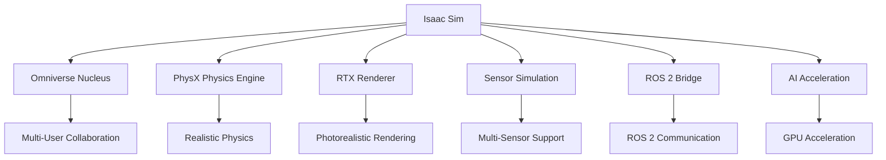

# NVIDIA Isaac Sim for Photorealistic Simulation: Synthetic Data and Environment Generation

## Overview

NVIDIA Isaac Sim represents a revolutionary approach to robotics simulation, providing photorealistic environments and synthetic data generation capabilities that bridge the gap between virtual and real-world robotic systems. Built on NVIDIA's Omniverse platform, Isaac Sim leverages advanced rendering technologies, physics simulation, and AI acceleration to create highly realistic digital twins for humanoid robotics development. The platform's ability to generate synthetic training data with ground truth annotations makes it invaluable for developing robust perception and control systems that can effectively transfer from simulation to reality.

Isaac Sim's integration with the broader Isaac ecosystem, including Isaac ROS and Isaac Apps, provides a comprehensive development pipeline from simulation to deployment. The platform's support for domain randomization, multi-sensor simulation, and complex scene generation enables the creation of diverse training environments that enhance the robustness of AI models for physical AI applications.

## Learning Objectives

By the end of this section, you should be able to:
- Create photorealistic simulation environments using Isaac Sim
- Generate synthetic training data for perception algorithms
- Validate perception models in simulation before real-world deployment
- Optimize simulation parameters for effective sim-to-real transfer

## Introduction to NVIDIA Isaac Sim

### What is Isaac Sim?

**NVIDIA Isaac Sim** is a comprehensive robotics simulation environment built on NVIDIA's Omniverse platform. It provides:

- **Photorealistic Rendering**: Using RTX real-time ray tracing for lifelike visual quality
- **Accurate Physics Simulation**: High-fidelity physics using PhysX engine
- **Multi-Sensor Simulation**: Realistic simulation of cameras, LiDAR, IMUs, and other sensors
- **Synthetic Data Generation**: Creation of annotated training data with ground truth
- **Domain Randomization**: Techniques to improve sim-to-real transfer
- **ROS 2 Integration**: Seamless integration with ROS 2 communication protocols

### Isaac Sim Architecture

Isaac Sim follows a modular architecture that integrates with Omniverse:



### Key Components

1. **Omniverse Framework**: Provides the underlying platform for 3D simulation
2. **PhysX Integration**: Ensures accurate physics simulation
3. **RTX Rendering**: Delivers photorealistic visual output
4. **Sensor Simulation**: Models various sensor types with realistic noise
5. **ROS Bridge**: Enables communication with ROS 2 systems
6. **AI Acceleration**: Leverages GPU computing for perception tasks

## Installation and Setup

### System Requirements

Isaac Sim has specific hardware requirements for optimal performance:

```bash
# Minimum requirements
- NVIDIA GPU with RTX support (RTX 2060 or better)
- CUDA 11.8 or later
- 16GB RAM (32GB recommended)
- Multi-core CPU (8+ cores recommended)

# Recommended for humanoid robotics simulation
- NVIDIA RTX 3080 or higher
- 32GB+ RAM
- Fast SSD storage
- Multiple CPU cores for parallel processing
```

### Installation Process

```bash
# Install Isaac Sim via Omniverse Launcher
# 1. Download and install Omniverse Launcher from NVIDIA Developer website
# 2. Launch Omniverse Launcher and install Isaac Sim
# 3. Install required extensions

# Alternative: Install via pip (for development)
pip install omni-isaac-gym-py

# Verify installation
python -c "import omni; print('Isaac Sim installed successfully')"
```

### Initial Configuration

```python
# Example: Basic Isaac Sim configuration
import omni
from omni.isaac.core import World
from omni.isaac.core.utils.stage import add_reference_to_stage
from omni.isaac.core.utils.nucleus import find_nucleus_server
from omni.isaac.core.utils.carb import set_carb_setting

# Initialize Isaac Sim
def initialize_isaac_sim():
    """Initialize Isaac Sim with optimal settings for humanoid simulation"""

    # Set rendering settings for optimal performance
    set_carb_setting("/persistent/omnihydra/useSceneQueryMipmaps", True)
    set_carb_setting("/rtx/sceneDb/sdfImport/primType", "default")

    # Configure physics settings
    set_carb_setting("/physics/iterations", 8)
    set_carb_setting("/physics/worker_count", 4)

    # Create world instance
    world = World(stage_units_in_meters=1.0)

    return world

# Example configuration for humanoid robot simulation
class HumanoidSimulationConfig:
    def __init__(self):
        self.render_resolution = (1920, 1080)  # HD resolution
        self.render_frequency = 60.0  # Hz
        self.physics_frequency = 600.0  # Hz (10x real-time)
        self.gravity = -9.81  # m/s^2

        # Humanoid-specific parameters
        self.robot_scale = 1.0  # Full scale humanoid
        self.balance_threshold = 0.1  # meters for CoM stability
        self.step_frequency = 2.0  # steps per second

        # Sensor configurations
        self.camera_config = {
            'resolution': (640, 480),
            'fov': 60,  # degrees
            'update_rate': 30.0  # Hz
        }

        self.lidar_config = {
            'range': 30.0,  # meters
            'resolution': 0.25,  # degrees
            'update_rate': 10.0  # Hz
        }
```

## Creating Photorealistic Environments

### Environment Design Principles

Creating effective photorealistic environments requires attention to several key principles:

```python
class EnvironmentDesigner:
    def __init__(self):
        self.material_system = MaterialSystem()
        self.lighting_system = LightingSystem()
        self.asset_manager = AssetManager()

    def design_photorealistic_environment(self, environment_type):
        """Design photorealistic environment based on type"""
        if environment_type == "indoor_office":
            return self.create_indoor_office_environment()
        elif environment_type == "outdoor_urban":
            return self.create_outdoor_urban_environment()
        elif environment_type == "home_environment":
            return self.create_home_environment()
        else:
            raise ValueError(f"Unknown environment type: {environment_type}")

    def create_indoor_office_environment(self):
        """Create photorealistic indoor office environment"""
        # Load base scene
        office_scene = self.asset_manager.load_asset("office_scene.usd")

        # Apply realistic materials
        self.material_system.apply_realistic_materials(office_scene)

        # Configure lighting
        self.lighting_system.configure_office_lighting(office_scene)

        # Add dynamic elements
        self.add_dynamic_office_elements(office_scene)

        # Set up sensor positions
        self.setup_sensor_positions(office_scene)

        return office_scene

    def apply_realistic_materials(self, scene):
        """Apply physically-based materials for realism"""
        # Wall materials with realistic textures
        wall_material = self.material_system.create_material(
            name="realistic_wall",
            base_color=(0.8, 0.8, 0.8),
            roughness=0.2,
            metallic=0.0,
            specular=0.5
        )

        # Floor materials with realistic properties
        floor_material = self.material_system.create_material(
            name="realistic_floor",
            base_color=(0.3, 0.3, 0.3),
            roughness=0.1,
            metallic=0.0,
            specular=0.3,
            normal_map="textures/floor_normal.png"
        )

        # Apply materials to scene objects
        self.material_system.apply_material_to_objects(
            scene,
            "wall_objects",
            wall_material
        )
        self.material_system.apply_material_to_objects(
            scene,
            "floor_objects",
            floor_material
        )

    def configure_office_lighting(self, scene):
        """Configure realistic office lighting"""
        # Main overhead lighting
        overhead_lights = self.lighting_system.create_area_lights(
            count=12,
            intensity=1000,
            color=(0.95, 0.95, 1.0),  # Slightly cool white
            size=(0.3, 0.3)
        )

        # Natural lighting from windows
        window_lights = self.lighting_system.create_dome_light(
            intensity=30000,
            color=(0.98, 0.95, 0.9),
            texture="textures/sky_hdri.exr"
        )

        # Add subtle shadows and reflections
        self.lighting_system.enable_advanced_shadows(scene)
        self.lighting_system.enable_reflections(scene)
```

### Asset Creation and Management

```python
class AssetManager:
    def __init__(self):
        self.asset_cache = {}
        self.material_library = MaterialLibrary()
        self.texture_library = TextureLibrary()

    def create_humanoid_robot_asset(self, robot_config):
        """Create humanoid robot asset with realistic materials"""
        # Create robot base
        robot_asset = self.create_robot_skeleton(robot_config)

        # Add realistic materials to robot parts
        self.apply_robot_materials(robot_asset, robot_config)

        # Configure physical properties
        self.configure_robot_physics(robot_asset, robot_config)

        # Add sensor mounts
        self.add_robot_sensors(robot_asset, robot_config)

        return robot_asset

    def create_robot_skeleton(self, config):
        """Create robot skeleton with proper joint hierarchy"""
        # Create base link
        base_link = self.create_link(
            name="base_link",
            mass=config.mass_distribution['base'],
            inertia=config.inertia_tensor['base'],
            geometry=config.geometry['base']
        )

        # Create links for each body part
        links = {
            'base': base_link,
            'torso': self.create_link(name="torso", ...),
            'head': self.create_link(name="head", ...),
            'left_arm': self.create_link(name="left_arm", ...),
            'right_arm': self.create_link(name="right_arm", ...),
            'left_leg': self.create_link(name="left_leg", ...),
            'right_leg': self.create_link(name="right_leg", ...)
        }

        # Create joints to connect links
        joints = self.create_robot_joints(links, config.joint_limits)

        return {'links': links, 'joints': joints}

    def apply_robot_materials(self, robot_asset, config):
        """Apply realistic materials to robot surfaces"""
        # Different materials for different robot parts
        materials = {
            'head': self.material_library.get_material('robot_head'),
            'torso': self.material_library.get_material('robot_torso'),
            'limbs': self.material_library.get_material('robot_limb'),
            'joints': self.material_library.get_material('robot_joint')
        }

        # Apply wear patterns and surface details
        for part_name, material in materials.items():
            self.add_surface_details(robot_asset[part_name], material)
            self.add_wear_patterns(robot_asset[part_name], config.operational_hours)

    def add_surface_details(self, part, base_material):
        """Add surface details like scratches, wear, etc."""
        # Add normal maps for surface detail
        detail_normal = self.texture_library.get_normal_map('robot_surface_detail')
        base_material.set_normal_map(detail_normal)

        # Add roughness variation
        base_material.set_roughness_map(
            self.texture_library.get_roughness_map('robot_surface_roughness')
        )

        # Add subtle color variation
        base_material.set_color_variation(0.05)  # 5% color variation
```

## Synthetic Data Generation

### Photorealistic Data Pipeline

```python
class SyntheticDataGenerator:
    def __init__(self, isaac_sim_world):
        self.world = isaac_sim_world
        self.data_pipeline = DataPipeline()
        self.annotation_system = AnnotationSystem()
        self.domain_randomizer = DomainRandomizer()

    def generate_synthetic_dataset(self, config):
        """Generate synthetic dataset with annotations"""
        dataset = []

        for scene_config in config.scene_configs:
            # Randomize environment
            randomized_scene = self.domain_randomizer.randomize_scene(scene_config)

            # Place robot and objects
            self.setup_scene_objects(randomized_scene, config.robot_pose)

            # Capture multiple viewpoints and lighting conditions
            for viewpoint in config.viewpoints:
                for lighting in config.lighting_conditions:
                    # Set viewpoint and lighting
                    self.set_camera_viewpoint(viewpoint)
                    self.set_lighting_condition(lighting)

                    # Capture data
                    frame_data = self.capture_frame_with_annotations()
                    dataset.append(frame_data)

        return dataset

    def capture_frame_with_annotations(self):
        """Capture frame with ground truth annotations"""
        # Capture RGB image
        rgb_image = self.capture_rgb_image()

        # Capture depth image
        depth_image = self.capture_depth_image()

        # Capture segmentation masks
        instance_mask = self.capture_instance_segmentation()
        semantic_mask = self.capture_semantic_segmentation()

        # Capture 3D point cloud
        point_cloud = self.capture_point_cloud()

        # Generate annotations
        annotations = self.annotation_system.generate_annotations(
            rgb_image,
            depth_image,
            instance_mask,
            semantic_mask,
            point_cloud
        )

        return {
            'rgb': rgb_image,
            'depth': depth_image,
            'instance_mask': instance_mask,
            'semantic_mask': semantic_mask,
            'point_cloud': point_cloud,
            'annotations': annotations,
            'metadata': self.get_frame_metadata()
        }

    def capture_rgb_image(self):
        """Capture RGB image from simulation"""
        # This would interface with Isaac Sim's rendering system
        # to capture photorealistic RGB images
        pass

    def capture_depth_image(self):
        """Capture depth image from simulation"""
        # Use Isaac Sim's depth sensor simulation
        # to generate accurate depth information
        pass

    def capture_instance_segmentation(self):
        """Capture instance segmentation masks"""
        # Generate per-object segmentation masks
        # where each object has a unique ID
        pass

    def capture_semantic_segmentation(self):
        """Capture semantic segmentation masks"""
        # Generate class-based segmentation masks
        # where pixels are labeled by object class
        pass
```

### Domain Randomization Techniques

```python
class DomainRandomizer:
    def __init__(self):
        self.randomization_params = {
            'lighting': {
                'intensity_range': (0.5, 2.0),
                'color_temperature_range': (3000, 8000),
                'position_jitter': 0.5
            },
            'materials': {
                'roughness_range': (0.0, 1.0),
                'metallic_range': (0.0, 0.5),
                'base_color_jitter': 0.1
            },
            'textures': {
                'scale_range': (0.5, 2.0),
                'rotation_range': (0, 360),
                'tiling_frequency': (1, 8)
            },
            'camera': {
                'position_jitter': 0.1,
                'orientation_jitter': 5.0,  # degrees
                'focus_jitter': 0.01
            }
        }

    def randomize_scene(self, base_scene_config):
        """Apply domain randomization to scene"""
        randomized_scene = base_scene_config.copy()

        # Randomize lighting conditions
        randomized_scene['lighting'] = self.randomize_lighting(
            base_scene_config['lighting']
        )

        # Randomize material properties
        randomized_scene['materials'] = self.randomize_materials(
            base_scene_config['materials']
        )

        # Randomize textures
        randomized_scene['textures'] = self.randomize_textures(
            base_scene_config['textures']
        )

        # Randomize camera parameters
        randomized_scene['camera'] = self.randomize_camera(
            base_scene_config['camera']
        )

        return randomized_scene

    def randomize_lighting(self, lighting_config):
        """Randomize lighting parameters"""
        randomized_lighting = lighting_config.copy()

        # Randomize light intensities
        for light in randomized_lighting['lights']:
            intensity_factor = np.random.uniform(
                self.randomization_params['lighting']['intensity_range'][0],
                self.randomization_params['lighting']['intensity_range'][1]
            )
            light['intensity'] *= intensity_factor

            # Randomize color temperature
            color_temp = np.random.uniform(
                self.randomization_params['lighting']['color_temperature_range'][0],
                self.randomization_params['lighting']['color_temperature_range'][1]
            )
            light['color'] = self.color_temperature_to_rgb(color_temp)

            # Add position jitter
            position_jitter = self.randomization_params['lighting']['position_jitter']
            light['position'] = [
                pos + np.random.uniform(-position_jitter, position_jitter)
                for pos in light['position']
            ]

        return randomized_lighting

    def randomize_materials(self, materials_config):
        """Randomize material properties"""
        randomized_materials = materials_config.copy()

        for material_name, material in randomized_materials.items():
            # Randomize roughness
            roughness_range = self.randomization_params['materials']['roughness_range']
            material['roughness'] = np.random.uniform(roughness_range[0], roughness_range[1])

            # Randomize metallic
            metallic_range = self.randomization_params['materials']['metallic_range']
            material['metallic'] = np.random.uniform(metallic_range[0], metallic_range[1])

            # Add base color jitter
            color_jitter = self.randomization_params['materials']['base_color_jitter']
            material['base_color'] = [
                max(0, min(1, color + np.random.uniform(-color_jitter, color_jitter)))
                for color in material['base_color']
            ]

        return randomized_materials

    def color_temperature_to_rgb(self, temperature):
        """Convert color temperature to RGB values"""
        # McCamy's formula for approximating RGB from color temperature
        if temperature <= 6600:
            red = 255
            green = temperature / 100 - 2
            green = -155.25485562709179 - 0.44596950469579133 * green +
                    104.49216199393888 * math.log(green)
        else:
            red = temperature / 100 - 55
            red = 351.97690566805693 + 0.114206453784165 * red -
                 40.25366309332127 * math.log(red)
            green = temperature / 100 - 50
            green = 325.4494125711974 + 0.07943456536662342 * green -
                   28.0852963507957 * math.log(green)

        blue = temperature / 100 - 20
        blue = -254.76935184120902 + 0.8274096064007395 * blue +
               115.67994401066147 * math.log(blue) if blue > 0 else 0

        return [
            max(0, min(255, int(red))) / 255.0,
            max(0, min(255, int(green))) / 255.0,
            max(0, min(255, int(blue))) / 255.0
        ]
```

## Sensor Simulation in Isaac Sim

### Multi-Sensor Integration

```python
class IsaacSensorSystem:
    def __init__(self, world):
        self.world = world
        self.sensors = {}
        self.sensor_data = {}

    def setup_robot_sensors(self, robot_prim, sensor_config):
        """Setup multiple sensors on robot for realistic simulation"""
        # Camera sensors
        self.setup_camera_sensors(robot_prim, sensor_config['cameras'])

        # LiDAR sensors
        self.setup_lidar_sensors(robot_prim, sensor_config['lidars'])

        # IMU sensors
        self.setup_imu_sensors(robot_prim, sensor_config['imus'])

        # Force/torque sensors
        self.setup_force_torque_sensors(robot_prim, sensor_config['ft_sensors'])

        # Other specialized sensors
        self.setup_specialized_sensors(robot_prim, sensor_config['other_sensors'])

    def setup_camera_sensors(self, robot_prim, camera_configs):
        """Setup camera sensors with realistic properties"""
        for config in camera_configs:
            # Create camera prim
            camera_prim = self.create_camera_prim(
                name=config['name'],
                position=config['position'],
                orientation=config['orientation']
            )

            # Configure camera properties
            self.configure_camera_properties(camera_prim, config)

            # Add realistic noise and artifacts
            self.add_camera_noise_model(camera_prim, config)

            # Register sensor
            self.sensors[config['name']] = {
                'type': 'camera',
                'prim': camera_prim,
                'config': config,
                'data_interface': self.create_camera_interface(camera_prim)
            }

    def configure_camera_properties(self, camera_prim, config):
        """Configure realistic camera properties"""
        # Set intrinsic parameters
        camera_prim.GetAttribute("horizontalAperture").Set(config['horizontal_aperture'])
        camera_prim.GetAttribute("verticalAperture").Set(config['vertical_aperture'])
        camera_prim.GetAttribute("focalLength").Set(config['focal_length'])

        # Set clipping range
        camera_prim.GetAttribute("clippingRange").Set(
            Gf.Vec2f(config['near_clip'], config['far_clip'])
        )

        # Configure sensor settings
        self.configure_sensor_resolution(camera_prim, config['resolution'])
        self.configure_sensor_framerate(camera_prim, config['framerate'])

        # Add realistic optical effects
        self.add_optical_effects(camera_prim, config)

    def add_camera_noise_model(self, camera_prim, config):
        """Add realistic noise model to camera"""
        # Define noise parameters based on camera type
        noise_config = {
            'gaussian_noise_std': config.get('gaussian_noise_std', 0.01),
            'poisson_noise_factor': config.get('poisson_noise_factor', 0.001),
            'fixed_pattern_noise': config.get('fixed_pattern_noise', 0.005),
            'temporal_noise': config.get('temporal_noise', 0.002)
        }

        # Apply noise model
        self.apply_noise_model(camera_prim, noise_config)

    def setup_lidar_sensors(self, robot_prim, lidar_configs):
        """Setup LiDAR sensors with realistic beam simulation"""
        for config in lidar_configs:
            # Create LiDAR prim
            lidar_prim = self.create_lidar_prim(
                name=config['name'],
                position=config['position'],
                orientation=config['orientation']
            )

            # Configure LiDAR properties
            self.configure_lidar_properties(lidar_prim, config)

            # Add realistic beam characteristics
            self.add_lidar_beam_model(lidar_prim, config)

            # Register sensor
            self.sensors[config['name']] = {
                'type': 'lidar',
                'prim': lidar_prim,
                'config': config,
                'data_interface': self.create_lidar_interface(lidar_prim)
            }

    def configure_lidar_properties(self, lidar_prim, config):
        """Configure realistic LiDAR properties"""
        # Set range parameters
        lidar_prim.GetAttribute("minRange").Set(config['min_range'])
        lidar_prim.GetAttribute("maxRange").Set(config['max_range'])

        # Set field of view
        lidar_prim.GetAttribute("horizontalFieldOfView").Set(config['horizontal_fov'])
        lidar_prim.GetAttribute("verticalFieldOfView").Set(config['vertical_fov'])

        # Set resolution
        lidar_prim.GetAttribute("horizontalResolution").Set(config['horizontal_resolution'])
        lidar_prim.GetAttribute("verticalResolution").Set(config['vertical_resolution'])

        # Set update rate
        lidar_prim.GetAttribute("updateRate").Set(config['update_rate'])

    def add_lidar_beam_model(self, lidar_prim, config):
        """Add realistic beam characteristics to LiDAR"""
        # Configure beam divergence
        beam_divergence = config.get('beam_divergence', 0.002)  # 2 mrad

        # Configure pulse characteristics
        pulse_width = config.get('pulse_width', 4e-9)  # 4 ns

        # Configure return intensity model
        intensity_model = config.get('intensity_model', 'simple')

        # Apply beam characteristics
        self.apply_beam_characteristics(lidar_prim, beam_divergence, pulse_width, intensity_model)
```

### Sensor Data Processing Pipeline

```python
class SensorDataProcessor:
    def __init__(self):
        self.data_buffer = {}
        self.processing_pipelines = {}
        self.synchronization_manager = SynchronizationManager()

    def process_sensor_data(self, raw_sensor_data):
        """Process raw sensor data with realistic transformations"""
        processed_data = {}

        for sensor_name, data in raw_sensor_data.items():
            sensor_type = self.get_sensor_type(sensor_name)

            if sensor_type == 'camera':
                processed_data[sensor_name] = self.process_camera_data(data)
            elif sensor_type == 'lidar':
                processed_data[sensor_name] = self.process_lidar_data(data)
            elif sensor_type == 'imu':
                processed_data[sensor_name] = self.process_imu_data(data)
            elif sensor_type == 'force_torque':
                processed_data[sensor_name] = self.process_force_torque_data(data)

        # Synchronize data across sensors
        synchronized_data = self.synchronization_manager.synchronize_data(processed_data)

        return synchronized_data

    def process_camera_data(self, camera_data):
        """Process camera data with realistic effects"""
        # Apply lens distortion
        undistorted_image = self.apply_lens_distortion(
            camera_data['image'],
            camera_data['distortion_coefficients']
        )

        # Add realistic noise
        noisy_image = self.add_realistic_camera_noise(undistorted_image)

        # Apply motion blur if applicable
        motion_blurred_image = self.apply_motion_blur(
            noisy_image,
            camera_data['motion_vectors']
        )

        # Convert to appropriate format
        processed_image = self.convert_image_format(motion_blurred_image)

        return {
            'image': processed_image,
            'timestamp': camera_data['timestamp'],
            'camera_info': camera_data['camera_info'],
            'distortion_coefficients': camera_data['distortion_coefficients']
        }

    def process_lidar_data(self, lidar_data):
        """Process LiDAR data with realistic characteristics"""
        # Apply beam characteristics
        processed_points = self.apply_beam_characteristics(
            lidar_data['points'],
            lidar_data['beam_parameters']
        )

        # Add realistic noise and artifacts
        noisy_points = self.add_lidar_noise(processed_points)

        # Apply range-dependent effects
        range_corrected_points = self.apply_range_correction(noisy_points)

        # Filter invalid points
        valid_points = self.filter_invalid_points(range_corrected_points)

        return {
            'points': valid_points,
            'intensities': lidar_data.get('intensities', []),
            'timestamp': lidar_data['timestamp'],
            'lidar_info': lidar_data['lidar_info']
        }

    def apply_lens_distortion(self, image, distortion_coeffs):
        """Apply realistic lens distortion to image"""
        # Apply radial and tangential distortion
        k1, k2, p1, p2, k3 = distortion_coeffs

        # Get image dimensions
        h, w = image.shape[:2]

        # Create coordinate grids
        x_coords, y_coords = np.meshgrid(np.arange(w), np.arange(h))

        # Normalize coordinates
        x_norm = (x_coords - w/2) / (w/2)
        y_norm = (y_coords - h/2) / (h/2)

        # Calculate distortion
        r_squared = x_norm**2 + y_norm**2
        radial_distortion = 1 + k1*r_squared + k2*r_squared**2 + k3*r_squared**3
        tangential_distortion_x = 2*p1*x_norm*y_norm + p2*(r_squared + 2*x_norm**2)
        tangential_distortion_y = p1*(r_squared + 2*y_norm**2) + 2*p2*x_norm*y_norm

        # Apply distortion
        x_distorted = x_norm * radial_distortion + tangential_distortion_x
        y_distorted = y_norm * radial_distortion + tangential_distortion_y

        # Convert back to pixel coordinates
        x_pixels = (x_distorted * w/2 + w/2).astype(np.float32)
        y_pixels = (y_distorted * h/2 + h/2).astype(np.float32)

        # Remap image
        distorted_image = cv2.remap(
            image,
            x_pixels, y_pixels,
            interpolation=cv2.INTER_LINEAR,
            borderMode=cv2.BORDER_REFLECT
        )

        return distorted_image
```

## Integration with Isaac ROS

### Isaac ROS Bridge

```python
import rclpy
from rclpy.node import Node
from sensor_msgs.msg import Image, PointCloud2, Imu, LaserScan
from geometry_msgs.msg import Twist, PoseStamped
from std_msgs.msg import Float32MultiArray
import numpy as np

class IsaacROSBridge(Node):
    def __init__(self):
        super().__init__('isaac_ros_bridge')

        # Publishers for sensor data
        self.rgb_pub = self.create_publisher(Image, '/camera/rgb/image_raw', 10)
        self.depth_pub = self.create_publisher(Image, '/camera/depth/image_raw', 10)
        self.lidar_pub = self.create_publisher(LaserScan, '/scan', 10)
        self.imu_pub = self.create_publisher(Imu, '/imu/data', 10)

        # Subscribers for control commands
        self.cmd_vel_sub = self.create_subscription(
            Twist, '/cmd_vel', self.cmd_vel_callback, 10
        )
        self.joint_cmd_sub = self.create_subscription(
            Float32MultiArray, '/joint_commands', self.joint_cmd_callback, 10
        )

        # Isaac Sim interface
        self.isaac_interface = IsaacSimInterface()

        # Timer for data publishing
        self.publish_timer = self.create_timer(0.033, self.publish_sensor_data)  # ~30 Hz

        self.get_logger().info('Isaac ROS Bridge initialized')

    def publish_sensor_data(self):
        """Publish sensor data from Isaac Sim to ROS topics"""
        # Get sensor data from Isaac Sim
        sensor_data = self.isaac_interface.get_sensor_data()

        # Publish RGB image
        if 'rgb_camera' in sensor_data:
            rgb_msg = self.create_image_message(sensor_data['rgb_camera'])
            self.rgb_pub.publish(rgb_msg)

        # Publish depth image
        if 'depth_camera' in sensor_data:
            depth_msg = self.create_depth_message(sensor_data['depth_camera'])
            self.depth_pub.publish(depth_msg)

        # Publish LiDAR scan
        if 'lidar' in sensor_data:
            lidar_msg = self.create_laser_scan_message(sensor_data['lidar'])
            self.lidar_pub.publish(lidar_msg)

        # Publish IMU data
        if 'imu' in sensor_data:
            imu_msg = self.create_imu_message(sensor_data['imu'])
            self.imu_pub.publish(imu_msg)

    def cmd_vel_callback(self, msg):
        """Handle velocity commands from ROS"""
        # Convert Twist message to robot motion commands
        linear_vel = [msg.linear.x, msg.linear.y, msg.linear.z]
        angular_vel = [msg.angular.x, msg.angular.y, msg.angular.z]

        # Send to Isaac Sim
        self.isaac_interface.set_robot_velocity(linear_vel, angular_vel)

    def joint_cmd_callback(self, msg):
        """Handle joint position commands from ROS"""
        # Convert Float32MultiArray to joint positions
        joint_positions = list(msg.data)

        # Send to Isaac Sim
        self.isaac_interface.set_joint_positions(joint_positions)

    def create_image_message(self, image_data):
        """Create ROS Image message from Isaac Sim image data"""
        from cv_bridge import CvBridge

        bridge = CvBridge()

        # Convert Isaac Sim image format to OpenCV
        cv_image = self.isaac_to_cv2(image_data)

        # Create Image message
        img_msg = bridge.cv2_to_imgmsg(cv_image, encoding='bgr8')
        img_msg.header.stamp = self.get_clock().now().to_msg()
        img_msg.header.frame_id = 'camera_rgb_optical_frame'

        return img_msg

    def create_laser_scan_message(self, lidar_data):
        """Create ROS LaserScan message from Isaac Sim LiDAR data"""
        scan_msg = LaserScan()

        scan_msg.header.stamp = self.get_clock().now().to_msg()
        scan_msg.header.frame_id = 'lidar_link'

        # Set scan parameters
        scan_msg.angle_min = lidar_data['angle_min']
        scan_msg.angle_max = lidar_data['angle_max']
        scan_msg.angle_increment = lidar_data['angle_increment']
        scan_msg.time_increment = lidar_data['time_increment']
        scan_msg.scan_time = lidar_data['scan_time']
        scan_msg.range_min = lidar_data['range_min']
        scan_msg.range_max = lidar_data['range_max']

        # Set range data
        scan_msg.ranges = lidar_data['ranges']
        scan_msg.intensities = lidar_data.get('intensities', [])

        return scan_msg

    def create_imu_message(self, imu_data):
        """Create ROS IMU message from Isaac Sim IMU data"""
        imu_msg = Imu()

        imu_msg.header.stamp = self.get_clock().now().to_msg()
        imu_msg.header.frame_id = 'imu_link'

        # Set orientation (if available)
        if 'orientation' in imu_data:
            imu_msg.orientation.x = imu_data['orientation']['x']
            imu_msg.orientation.y = imu_data['orientation']['y']
            imu_msg.orientation.z = imu_data['orientation']['z']
            imu_msg.orientation.w = imu_data['orientation']['w']
            imu_msg.orientation_covariance = [0.0] * 9  # No covariance data

        # Set angular velocity
        imu_msg.angular_velocity.x = imu_data['angular_velocity']['x']
        imu_msg.angular_velocity.y = imu_data['angular_velocity']['y']
        imu_msg.angular_velocity.z = imu_data['angular_velocity']['z']
        imu_msg.angular_velocity_covariance = [0.0] * 9

        # Set linear acceleration
        imu_msg.linear_acceleration.x = imu_data['linear_acceleration']['x']
        imu_msg.linear_acceleration.y = imu_data['linear_acceleration']['y']
        imu_msg.linear_acceleration.z = imu_data['linear_acceleration']['z']
        imu_msg.linear_acceleration_covariance = [0.0] * 9

        return imu_msg

class IsaacSimInterface:
    def __init__(self):
        # Initialize connection to Isaac Sim
        self.isaac_sim = None
        self.robot = None
        self.sensors = {}

    def get_sensor_data(self):
        """Get current sensor data from Isaac Sim"""
        sensor_data = {}

        # Get RGB camera data
        if 'rgb_camera' in self.sensors:
            sensor_data['rgb_camera'] = self.sensors['rgb_camera'].get_data()

        # Get depth camera data
        if 'depth_camera' in self.sensors:
            sensor_data['depth_camera'] = self.sensors['depth_camera'].get_data()

        # Get LiDAR data
        if 'lidar' in self.sensors:
            sensor_data['lidar'] = self.sensors['lidar'].get_data()

        # Get IMU data
        if 'imu' in self.sensors:
            sensor_data['imu'] = self.sensors['imu'].get_data()

        return sensor_data

    def set_robot_velocity(self, linear_vel, angular_vel):
        """Set robot velocity in Isaac Sim"""
        # This would interface with Isaac Sim's physics engine
        # to set the robot's velocity
        pass

    def set_joint_positions(self, joint_positions):
        """Set joint positions in Isaac Sim"""
        # This would interface with Isaac Sim's articulation controller
        # to set the robot's joint positions
        pass
```

## Performance Optimization

### Efficient Rendering and Simulation

```python
class PerformanceOptimizer:
    def __init__(self, isaac_sim_world):
        self.world = isaac_sim_world
        self.render_settings = RenderSettings()
        self.physics_settings = PhysicsSettings()
        self.level_of_detail = LevelOfDetailManager()

    def optimize_simulation_performance(self, target_fps=60):
        """Optimize simulation for target performance"""
        # Adjust rendering quality
        self.adjust_rendering_quality(target_fps)

        # Optimize physics simulation
        self.optimize_physics_parameters()

        # Apply level of detail
        self.apply_level_of_detail()

        # Enable multi-threading
        self.enable_multithreading()

    def adjust_rendering_quality(self, target_fps):
        """Adjust rendering settings for performance"""
        # Calculate available time per frame
        available_time = 1.0 / target_fps

        # Adjust MSAA (Multi-Sample Anti-Aliasing)
        if available_time < 0.016:  # Less than 60 FPS available time
            self.render_settings.set_msaa_samples(1)  # Disable MSAA
        elif available_time < 0.033:  # Less than 30 FPS available time
            self.render_settings.set_msaa_samples(2)  # Low MSAA
        else:
            self.render_settings.set_msaa_samples(4)  # High MSAA

        # Adjust texture streaming
        if available_time < 0.016:
            self.render_settings.set_texture_resolution_scale(0.5)  # 50% resolution
        else:
            self.render_settings.set_texture_resolution_scale(1.0)  # Full resolution

        # Adjust shadow quality
        if available_time < 0.016:
            self.render_settings.set_shadow_resolution(512)  # Low shadow resolution
        else:
            self.render_settings.set_shadow_resolution(2048)  # High shadow resolution

    def optimize_physics_parameters(self):
        """Optimize physics simulation parameters"""
        # Adjust solver iterations based on scene complexity
        scene_complexity = self.estimate_scene_complexity()

        if scene_complexity > 0.7:  # High complexity
            self.physics_settings.set_solver_iterations(4)  # Fewer iterations
            self.physics_settings.set_substeps(2)  # More substeps for stability
        elif scene_complexity > 0.4:  # Medium complexity
            self.physics_settings.set_solver_iterations(8)  # Medium iterations
            self.physics_settings.set_substeps(1)  # Default substeps
        else:  # Low complexity
            self.physics_settings.set_solver_iterations(16)  # More iterations
            self.physics_settings.set_substeps(1)  # Default substeps

        # Adjust collision detection parameters
        self.physics_settings.set_broadphase_type('SAP')  # Sweep and Prune
        self.physics_settings.set_contact_distance(0.001)  # 1mm contact distance

    def apply_level_of_detail(self):
        """Apply level of detail to reduce rendering load"""
        # Set distance thresholds for different LOD levels
        lod_settings = {
            'high_detail': {'distance': 2.0, 'enabled': True},
            'medium_detail': {'distance': 5.0, 'enabled': True},
            'low_detail': {'distance': 10.0, 'enabled': True},
            'very_low_detail': {'distance': 20.0, 'enabled': True}
        }

        self.level_of_detail.set_lod_settings(lod_settings)

        # Apply LOD to all objects in scene
        for obj in self.world.get_objects():
            self.level_of_detail.apply_to_object(obj)

    def estimate_scene_complexity(self):
        """Estimate scene complexity for optimization"""
        num_objects = len(self.world.get_objects())
        num_lights = len(self.world.get_lights())
        num_joints = len(self.world.get_joints())
        num_triangles = self.world.get_triangle_count()

        # Normalize complexity metrics
        normalized_objects = min(num_objects / 100.0, 1.0)
        normalized_lights = min(num_lights / 10.0, 1.0)
        normalized_joints = min(num_joints / 50.0, 1.0)
        normalized_triangles = min(num_triangles / 100000.0, 1.0)

        # Weighted complexity score
        complexity = (
            0.3 * normalized_objects +
            0.2 * normalized_lights +
            0.2 * normalized_joints +
            0.3 * normalized_triangles
        )

        return complexity

class RenderSettings:
    def __init__(self):
        self.msaa_samples = 4
        self.texture_resolution_scale = 1.0
        self.shadow_resolution = 2048
        self.enable_post_processing = True
        self.enable_global_illumination = True

    def set_msaa_samples(self, samples):
        """Set MSAA sample count"""
        self.msaa_samples = samples

    def set_texture_resolution_scale(self, scale):
        """Set texture resolution scale"""
        self.texture_resolution_scale = scale

    def set_shadow_resolution(self, resolution):
        """Set shadow map resolution"""
        self.shadow_resolution = resolution

class PhysicsSettings:
    def __init__(self):
        self.solver_iterations = 8
        self.substeps = 1
        self.broadphase_type = 'SAP'
        self.contact_distance = 0.001

    def set_solver_iterations(self, iterations):
        """Set physics solver iterations"""
        self.solver_iterations = iterations

    def set_substeps(self, substeps):
        """Set physics substeps"""
        self.substeps = substeps
```

## Practical Applications in Humanoid Robotics

### Perception Training with Synthetic Data

```python
class PerceptionTrainingSystem:
    def __init__(self, isaac_sim_generator):
        self.data_generator = isaac_sim_generator
        self.model_trainer = ModelTrainer()
        self.validation_system = ValidationSystem()

    def train_perception_model(self, model_config):
        """Train perception model using synthetic data"""
        # Generate synthetic training dataset
        train_dataset = self.data_generator.generate_dataset(
            config=model_config['train_data_config']
        )

        # Generate synthetic validation dataset
        val_dataset = self.data_generator.generate_dataset(
            config=model_config['val_data_config']
        )

        # Train model on synthetic data
        trained_model = self.model_trainer.train(
            train_dataset,
            validation_dataset=val_dataset,
            config=model_config
        )

        # Validate on synthetic data
        synthetic_metrics = self.validation_system.validate(
            trained_model,
            val_dataset
        )

        # Fine-tune with minimal real data
        if model_config['use_real_data_finetuning']:
            real_dataset = self.load_real_dataset(model_config['real_data_path'])
            fine_tuned_model = self.model_trainer.finetune(
                trained_model,
                real_dataset,
                config=model_config['finetune_config']
            )
        else:
            fine_tuned_model = trained_model

        return fine_tuned_model, synthetic_metrics

    def validate_sim_to_real_transfer(self, model, real_dataset):
        """Validate model performance on real-world data"""
        # Test model on real dataset
        real_metrics = self.validation_system.validate(model, real_dataset)

        # Calculate sim-to-real gap
        sim_to_real_gap = self.calculate_gap(real_metrics)

        # Generate transferability report
        report = self.generate_transfer_report(real_metrics, sim_to_real_gap)

        return real_metrics, sim_to_real_gap, report

    def calculate_gap(self, real_metrics):
        """Calculate sim-to-real performance gap"""
        # Compare with expected synthetic performance
        expected_synthetic = real_metrics.get('expected_synthetic_performance', {})

        gap_metrics = {}
        for metric_name, real_value in real_metrics.items():
            if metric_name in expected_synthetic:
                gap = expected_synthetic[metric_name] - real_value
                gap_metrics[f'{metric_name}_gap'] = gap

        return gap_metrics

    def generate_transfer_report(self, real_metrics, gap_metrics):
        """Generate comprehensive transferability report"""
        report = {
            'real_performance': real_metrics,
            'sim_to_real_gaps': gap_metrics,
            'transfer_success_score': self.calculate_transfer_score(gap_metrics),
            'recommendations': self.generate_recommendations(gap_metrics),
            'confidence_intervals': self.calculate_confidence_intervals(real_metrics)
        }

        return report

    def generate_recommendations(self, gap_metrics):
        """Generate recommendations based on transfer gaps"""
        recommendations = []

        for metric_name, gap in gap_metrics.items():
            if gap > 0.1:  # Significant gap (>10%)
                if 'accuracy' in metric_name.lower():
                    recommendations.append(
                        f"Accuracy gap detected: Consider additional domain randomization "
                        f"for {metric_name.replace('_gap', '')}"
                    )
                elif 'precision' in metric_name.lower():
                    recommendations.append(
                        f"Precision gap detected: Consider adjusting confidence thresholds "
                        f"for {metric_name.replace('_gap', '')}"
                    )
                elif 'recall' in metric_name.lower():
                    recommendations.append(
                        f"Recall gap detected: Consider adding more diverse training scenarios "
                        f"for {metric_name.replace('_gap', '')}"
                    )

        return recommendations
```

### Humanoid Robot Simulation Pipeline

```python
class HumanoidSimulationPipeline:
    def __init__(self):
        self.environment_manager = EnvironmentManager()
        self.robot_manager = RobotManager()
        self.perception_system = PerceptionSystem()
        self.control_system = ControlSystem()
        self.data_collector = DataCollector()

    def run_simulation_episode(self, episode_config):
        """Run a complete simulation episode"""
        # Setup environment
        environment = self.environment_manager.setup_environment(
            episode_config['environment']
        )

        # Setup robot
        robot = self.robot_manager.setup_robot(
            episode_config['robot_config']
        )

        # Position robot in environment
        self.robot_manager.position_robot(
            robot,
            episode_config['initial_position']
        )

        # Initialize systems
        self.perception_system.initialize(robot, environment)
        self.control_system.initialize(robot)

        # Run simulation loop
        episode_data = []
        current_time = 0.0
        max_time = episode_config['max_episode_time']

        while current_time < max_time:
            # Sense environment
            sensor_data = self.perception_system.get_sensor_data()

            # Process perception
            perception_result = self.perception_system.process(sensor_data)

            # Plan action
            action = self.control_system.plan_action(
                perception_result,
                episode_config['goal']
            )

            # Execute action
            self.control_system.execute_action(robot, action)

            # Collect data
            step_data = {
                'timestamp': current_time,
                'sensor_data': sensor_data,
                'perception_result': perception_result,
                'action': action,
                'robot_state': self.robot_manager.get_state(robot)
            }

            episode_data.append(step_data)

            # Update simulation
            self.environment_manager.update_environment()
            current_time += episode_config['time_step']

        # Collect episode metrics
        episode_metrics = self.calculate_episode_metrics(episode_data)

        return episode_data, episode_metrics

    def calculate_episode_metrics(self, episode_data):
        """Calculate metrics for simulation episode"""
        metrics = {}

        # Navigation metrics
        if len(episode_data) > 0:
            start_pos = episode_data[0]['robot_state']['position']
            end_pos = episode_data[-1]['robot_state']['position']
            total_distance = self.calculate_path_distance(episode_data)

            metrics['total_distance'] = total_distance
            metrics['displacement'] = np.linalg.norm(
                np.array(end_pos) - np.array(start_pos)
            )
            metrics['path_efficiency'] = metrics['displacement'] / total_distance if total_distance > 0 else 0

        # Balance metrics
        balance_deviations = [
            step['robot_state'].get('balance_deviation', 0)
            for step in episode_data
        ]
        metrics['avg_balance_deviation'] = np.mean(balance_deviations)
        metrics['max_balance_deviation'] = np.max(balance_deviations) if balance_deviations else 0

        # Success metrics
        goal_reached = episode_data[-1]['robot_state'].get('goal_reached', False)
        metrics['goal_reached'] = goal_reached
        metrics['episode_success'] = goal_reached and metrics['avg_balance_deviation'] < 0.1

        return metrics

    def batch_simulation_runs(self, experiment_config):
        """Run multiple simulation episodes in batch"""
        all_results = []

        for episode_idx in range(experiment_config['num_episodes']):
            # Randomize episode parameters
            episode_config = self.randomize_episode_config(
                experiment_config['base_config']
            )

            # Run episode
            episode_data, metrics = self.run_simulation_episode(episode_config)

            # Store results
            all_results.append({
                'episode_id': episode_idx,
                'config': episode_config,
                'data': episode_data,
                'metrics': metrics
            })

        # Aggregate results
        aggregated_metrics = self.aggregate_results(all_results)

        return all_results, aggregated_metrics

    def aggregate_results(self, all_results):
        """Aggregate metrics across multiple episodes"""
        if not all_results:
            return {}

        # Extract all metric names
        all_metric_names = set()
        for result in all_results:
            all_metric_names.update(result['metrics'].keys())

        # Calculate statistics for each metric
        aggregated = {}
        for metric_name in all_metric_names:
            values = [
                result['metrics'].get(metric_name, 0)
                for result in all_results
                if metric_name in result['metrics']
            ]

            if values:
                aggregated[metric_name] = {
                    'mean': np.mean(values),
                    'std': np.std(values),
                    'min': np.min(values),
                    'max': np.max(values),
                    'median': np.median(values)
                }

        return aggregated
```

## Best Practices for Isaac Sim Usage

### Quality Assurance and Validation

```python
class IsaacSimValidator:
    def __init__(self):
        self.simulation_validator = SimulationValidator()
        self.sensor_validator = SensorValidator()
        self.performance_validator = PerformanceValidator()

    def validate_simulation_setup(self, sim_config):
        """Validate Isaac Sim setup before running"""
        validation_results = {}

        # Validate physics setup
        validation_results['physics'] = self.simulation_validator.validate_physics(sim_config)

        # Validate sensor setup
        validation_results['sensors'] = self.sensor_validator.validate_sensors(sim_config)

        # Validate performance parameters
        validation_results['performance'] = self.performance_validator.validate_performance(sim_config)

        # Overall validation score
        overall_score = self.calculate_overall_validation_score(validation_results)
        validation_results['overall_score'] = overall_score
        validation_results['is_valid'] = overall_score >= 0.8  # 80% threshold

        return validation_results

    def calculate_overall_validation_score(self, validation_results):
        """Calculate overall validation score"""
        scores = []

        for category, result in validation_results.items():
            if isinstance(result, dict) and 'score' in result:
                scores.append(result['score'])

        return np.mean(scores) if scores else 0.0

class SimulationValidator:
    def validate_physics(self, config):
        """Validate physics configuration"""
        issues = []

        # Check gravity settings
        if abs(config.get('gravity', -9.81) - (-9.81)) > 0.1:
            issues.append("Gravity setting significantly different from Earth gravity")

        # Check time step
        time_step = config.get('time_step', 1/60)
        if time_step > 1/60:  # Too large time step
            issues.append("Time step too large, may cause instability")

        # Check solver settings
        solver_iterations = config.get('solver_iterations', 8)
        if solver_iterations < 4:
            issues.append("Low solver iterations may cause inaccurate physics")

        return {
            'score': 1.0 - len(issues) * 0.1,  # Deduct 0.1 per issue
            'issues': issues,
            'is_valid': len(issues) == 0
        }

class SensorValidator:
    def validate_sensors(self, config):
        """Validate sensor configuration"""
        issues = []

        sensors = config.get('sensors', {})

        for sensor_name, sensor_config in sensors.items():
            # Check sensor range
            if 'range' in sensor_config:
                if sensor_config['range'] <= 0:
                    issues.append(f"Invalid range for sensor {sensor_name}")

            # Check update rate
            update_rate = sensor_config.get('update_rate', 30.0)
            if update_rate <= 0:
                issues.append(f"Invalid update rate for sensor {sensor_name}")

        return {
            'score': 1.0 - len(issues) * 0.1,
            'issues': issues,
            'is_valid': len(issues) == 0
        }
```

## Summary

NVIDIA Isaac Sim provides a powerful platform for photorealistic robotics simulation, offering advanced rendering capabilities, accurate physics simulation, and comprehensive synthetic data generation. The platform's integration with the broader Isaac ecosystem enables the development of robust perception and control systems that can effectively transfer from simulation to reality.

The combination of photorealistic rendering, domain randomization techniques, and multi-sensor simulation makes Isaac Sim particularly valuable for humanoid robotics applications where realistic environment interaction and perception are critical. Proper validation and optimization of simulation parameters ensure that the synthetic data generated can be effectively used for training AI models that perform well in real-world scenarios.

## Further Reading

- NVIDIA Isaac Sim Documentation: https://docs.omniverse.nvidia.com/isaacsim/latest/
- "Real-Time Rendering" by Tomas Akenine-Möller et al.
- "Physically Based Rendering" by Matt Pharr, Wenzel Jakob, and Greg Humphreys
- "Computer Graphics: Principles and Practice" by Hughes, van Dam, McGuire, et al.
- Omniverse Developer Documentation: https://docs.omniverse.nvidia.com/