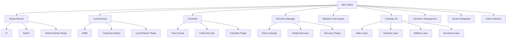

# Navigation and Path Planning with Nav2: Advanced Navigation Systems for Humanoid Robots

## Overview

Navigation and path planning form the cognitive navigation layer of humanoid robotics, enabling robots to move safely and efficiently through complex environments while maintaining balance and avoiding obstacles. The Navigation2 (Nav2) stack provides a comprehensive, flexible, and robust framework for mobile robot navigation that has been adapted for the unique requirements of humanoid robots. Unlike traditional wheeled robots, humanoid robots face distinct challenges in navigation due to their bipedal locomotion, dynamic balance requirements, and human-scale interaction patterns.

Nav2's component-based architecture allows for the customization of navigation behaviors to suit humanoid robot characteristics, including specialized planners for bipedal locomotion, balance-aware obstacle avoidance, and social navigation capabilities. The integration of perception data from multiple sensors, including those accelerated by Isaac ROS, enables sophisticated navigation strategies that account for both environmental constraints and the robot's physical limitations.

## Learning Objectives

By the end of this section, you should be able to:
- Configure Nav2 for humanoid robot-specific navigation requirements
- Implement dynamic path planning for complex humanoid environments
- Integrate perception data with navigation systems for obstacle avoidance
- Optimize navigation parameters for humanoid robot kinematics and dynamics

## Introduction to Navigation2 (Nav2)

### What is Nav2?

**Navigation2 (Nav2)** is the next-generation navigation stack for ROS 2, designed to provide robust, flexible, and configurable navigation capabilities for mobile robots. Key features include:

- **Component-Based Architecture**: Modular design allowing customization of navigation components
- **Behavior Trees**: Declarative behavior specification for complex navigation tasks
- **Advanced Planning Algorithms**: State-of-the-art global and local planners
- **Recovery Behaviors**: Robust handling of navigation failures
- **Simulation Integration**: Seamless integration with simulation environments
- **Extensive Plugin System**: Support for custom navigation behaviors and algorithms

### Nav2 Architecture

Nav2 follows a modular architecture with specialized components:



### Key Components and Their Functions

1. **Global Planner**: Computes high-level path from start to goal
2. **Local Planner**: Executes path while avoiding local obstacles
3. **Controller**: Translates plans into robot commands
4. **Costmap 2D**: Maintains obstacle and cost information
5. **Recovery Manager**: Handles navigation failures
6. **Behavior Tree Engine**: Orchestrates navigation behaviors

## Nav2 Installation and Configuration

### System Requirements and Installation

```bash
# Install Nav2 via apt
sudo apt update
sudo apt install ros-humble-navigation2
sudo apt install ros-humble-nav2-bringup
sudo apt install ros-humble-nav2-rviz-plugins

# Install additional dependencies
sudo apt install ros-humble-dwb-core
sudo apt install ros-humble-nav2-simple-commander
sudo apt install ros-humble-nav2-behaviors
```

### Basic Configuration for Humanoid Robots

```yaml
# config/nav2_params_humanoid.yaml
amcl:
  ros__parameters:
    use_sim_time: False
    alpha1: 0.2
    alpha2: 0.2
    alpha3: 0.2
    alpha4: 0.2
    alpha5: 0.2
    base_frame_id: "base_footprint"
    beam_count: 60
    do_beamskip: False
    global_frame_id: "map"
    lambda_short: 0.1
    laser_likelihood_max_dist: 2.0
    laser_max_range: 100.0
    laser_min_range: -1.0
    laser_model_type: "likelihood_field"
    max_beams: 60
    max_particles: 2000
    min_particles: 500
    odom_frame_id: "odom"
    pf_err: 0.05
    pf_z: 0.99
    recovery_alpha_fast: 0.0
    recovery_alpha_slow: 0.0
    resample_interval: 1
    robot_model_type: "nav2_amcl::DifferentialMotionModel"
    save_pose_rate: 0.5
    sigma_hit: 0.2
    tf_broadcast: True
    transform_tolerance: 1.0
    update_min_a: 0.2
    update_min_d: 0.25
    z_hit: 0.5
    z_max: 0.05
    z_rand: 0.5
    z_short: 0.05

amcl_map_client:
  ros__parameters:
    use_sim_time: False

amcl_rclcpp_node:
  ros__parameters:
    use_sim_time: False

bt_navigator:
  ros__parameters:
    use_sim_time: False
    global_frame: map
    robot_base_frame: base_footprint
    odom_topic: /odom
    bt_loop_duration: 10
    default_server_timeout: 20
    # Humanoid-specific behavior tree
    plugin_lib_names:
    - nav2_compute_path_to_pose_action_bt_node
    - nav2_follow_path_action_bt_node
    - nav2_back_up_action_bt_node
    - nav2_spin_action_bt_node
    - nav2_wait_action_bt_node
    - nav2_clear_costmap_service_bt_node
    - nav2_is_stuck_condition_bt_node
    - nav2_have_remaining_waypoints_condition_bt_node
    - nav2_is_path_valid_condition_bt_node
    - nav2_initial_pose_received_condition_bt_node
    - nav2_reinitialize_global_localization_service_bt_node
    - nav2_rate_controller_bt_node
    - nav2_distance_controller_bt_node
    - nav2_speed_controller_bt_node
    - nav2_truncate_path_action_bt_node
    - nav2_goal_updater_node_bt_node
    - nav2_recovery_node_bt_node
    - nav2_pipeline_sequence_bt_node
    - nav2_round_robin_node_bt_node
    - nav2_transformer_bt_node
    - nav2_is_battery_low_condition_bt_node
    - nav2_navigate_through_poses_action_bt_node
    - nav2_navigate_to_pose_action_bt_node
```

### Humanoid-Specific Costmap Configuration

```yaml
# config/costmap_humanoid.yaml
global_costmap:
  global_frame: map
  robot_base_frame: base_footprint
  update_frequency: 5.0
  publish_frequency: 2.0
  transform_tolerance: 0.5
  width: 40
  height: 40
  resolution: 0.05  # 5cm resolution for detailed planning
  origin_x: -20.0
  origin_y: -20.0
  plugins:
    - {name: static_layer, type: "nav2_costmap_2d::StaticLayer"}
    - {name: obstacle_layer, type: "nav2_costmap_2d::ObstacleLayer"}
    - {name: inflation_layer, type: "nav2_costmap_2d::InflationLayer"}
    - {name: humanoid_layer, type: "nav2_costmap_2d::HumanoidLayer"}  # Custom layer

  static_layer:
    map_topic: /map
    transform_tolerance: 0.5
    max_publish_frequency: 0.1

  obstacle_layer:
    enabled: True
    observation_sources: scan
    scan:
      topic: /scan
      max_obstacle_height: 2.0  # Humanoid can step over low obstacles
      clearing: True
      marking: True
      data_type: "LaserScan"
      raytrace_max_range: 3.0
      raytrace_min_range: 0.0
      obstacle_max_range: 2.5
      obstacle_min_range: 0.0

  inflation_layer:
    enabled: True
    cost_scaling_factor: 3.0  # Increased for humanoid safety
    inflation_radius: 0.6     # Larger safety margin for bipedal robot

  humanoid_layer:
    enabled: True
    step_height: 0.15         # Maximum step height humanoid can handle
    step_width: 0.3          # Minimum step width for stable walking
    balance_margin: 0.2      # Extra margin for balance considerations

local_costmap:
  global_frame: odom
  robot_base_frame: base_footprint
  update_frequency: 10.0
  publish_frequency: 5.0
  transform_tolerance: 0.5
  width: 6.0
  height: 6.0
  resolution: 0.05
  plugins:
    - {name: obstacle_layer, type: "nav2_costmap_2d::ObstacleLayer"}
    - {name: voxel_layer, type: "nav2_costmap_2d::VoxelLayer"}
    - {name: inflation_layer, type: "nav2_costmap_2d::InflationLayer"}

  obstacle_layer:
    enabled: True
    observation_sources: scan
    scan:
      topic: /scan
      max_obstacle_height: 2.0
      clearing: True
      marking: True
      data_type: "LaserScan"
      raytrace_max_range: 3.0
      raytrace_min_range: 0.0
      obstacle_max_range: 2.5
      obstacle_min_range: 0.0

  voxel_layer:
    enabled: True
    publish_voxel_map: False
    origin_z: 0.0
    z_resolution: 0.2
    z_voxels: 10
    max_obstacle_height: 2.0
    mark_threshold: 0
    observation_sources: scan
    scan:
      topic: /scan
      max_obstacle_height: 2.0
      clearing: True
      marking: True
      data_type: "LaserScan"
      raytrace_max_range: 3.0
      raytrace_min_range: 0.0
      obstacle_max_range: 2.5
      obstacle_min_range: 0.0

  inflation_layer:
    enabled: True
    cost_scaling_factor: 5.0  # Higher for local planning
    inflation_radius: 0.5
```

## Global Path Planning for Humanoid Robots

### Global Planner Configuration

```python
import rclpy
from rclpy.node import Node
from nav_msgs.msg import Path, OccupancyGrid
from geometry_msgs.msg import PoseStamped, Point
from sensor_msgs.msg import LaserScan
from tf2_ros import TransformListener, Buffer
import numpy as np

class HumanoidGlobalPlanner:
    def __init__(self, node):
        self.node = node
        self.tf_buffer = Buffer()
        self.tf_listener = TransformListener(self.tf_buffer, node)

        # Global planner parameters for humanoid
        self.step_size = 0.3  # Maximum step size for humanoid
        self.turn_radius = 0.4  # Minimum turning radius
        self.balance_margin = 0.2  # Safety margin for balance

        # Initialize path planners
        self.a_star_planner = AStarPlanner()
        self.hybrid_astar_planner = HybridAStarPlanner()
        self.visibility_graph_planner = VisibilityGraphPlanner()

    def plan_path(self, start_pose, goal_pose, costmap):
        """Plan path considering humanoid constraints"""
        # Convert poses to costmap coordinates
        start_coords = self.pose_to_costmap_coords(start_pose, costmap)
        goal_coords = self.pose_to_costmap_coords(goal_pose, costmap)

        # Plan path using humanoid-aware algorithm
        path = self.plan_humanoid_path(start_coords, goal_coords, costmap)

        # Smooth path for humanoid locomotion
        smoothed_path = self.smooth_humanoid_path(path)

        # Convert back to PoseStamped messages
        pose_path = self.path_to_pose_stamped(smoothed_path, costmap)

        return pose_path

    def plan_humanoid_path(self, start, goal, costmap):
        """Plan path considering humanoid locomotion constraints"""
        # Check if direct path is feasible
        direct_path = self.check_direct_path_feasibility(start, goal, costmap)

        if direct_path:
            return [start, goal]

        # Use A* with humanoid constraints
        path = self.a_star_planner.plan_with_constraints(
            start, goal, costmap, self.get_humanoid_constraints()
        )

        return path

    def get_humanoid_constraints(self):
        """Define constraints specific to humanoid locomotion"""
        return {
            'max_step_size': self.step_size,
            'min_turn_radius': self.turn_radius,
            'balance_margin': self.balance_margin,
            'step_height_tolerance': 0.15,  # Maximum step height
            'footprint_radius': 0.15       # Humanoid foot print
        }

    def check_direct_path_feasibility(self, start, goal, costmap):
        """Check if direct path is feasible for humanoid"""
        # Calculate path points
        path_points = self.discretize_path(start, goal, resolution=0.1)

        # Check each point for feasibility
        for point in path_points:
            if not self.is_point_feasible(point, costmap):
                return False

        # Check path width for humanoid
        if not self.is_path_width_sufficient(start, goal, costmap):
            return False

        return True

    def is_point_feasible(self, point, costmap):
        """Check if a point is feasible for humanoid"""
        x, y = point

        # Check costmap value
        cost = self.get_costmap_value(x, y, costmap)
        if cost >= 254:  # Occupied
            return False

        # Check balance constraints
        if not self.check_balance_feasibility(point, costmap):
            return False

        return True

    def check_balance_feasibility(self, point, costmap):
        """Check if point allows for stable balance"""
        # Check surrounding area for balance support
        balance_radius = self.balance_margin
        for dx in np.arange(-balance_radius, balance_radius, costmap.resolution):
            for dy in np.arange(-balance_radius, balance_radius, costmap.resolution):
                test_x = point[0] + dx
                test_y = point[1] + dy

                if self.is_in_costmap_bounds(test_x, test_y, costmap):
                    cost = self.get_costmap_value(test_x, test_y, costmap)
                    if cost >= 200:  # High cost area
                        return False

        return True

class AStarPlanner:
    def __init__(self):
        self.max_iterations = 10000
        self.step_size = 0.3

    def plan_with_constraints(self, start, goal, costmap, constraints):
        """A* planning with humanoid constraints"""
        import heapq

        # Initialize open and closed sets
        open_set = [(0, start)]
        came_from = {}
        g_score = {start: 0}
        f_score = {start: self.heuristic(start, goal)}

        while open_set:
            current = heapq.heappop(open_set)[1]

            if self.distance(current, goal) < 0.5:  # Goal reached
                return self.reconstruct_path(came_from, current)

            # Get neighbors considering humanoid constraints
            neighbors = self.get_humanoid_neighbors(current, costmap, constraints)

            for neighbor in neighbors:
                tentative_g_score = g_score[current] + self.distance(current, neighbor)

                if tentative_g_score < g_score.get(neighbor, float('inf')):
                    came_from[neighbor] = current
                    g_score[neighbor] = tentative_g_score
                    f_score[neighbor] = tentative_g_score + self.heuristic(neighbor, goal)

                    heapq.heappush(open_set, (f_score[neighbor], neighbor))

        return None  # No path found

    def get_humanoid_neighbors(self, point, costmap, constraints):
        """Get valid neighbors considering humanoid constraints"""
        neighbors = []
        max_step = constraints['max_step_size']

        # Generate potential neighbors in all directions
        for angle in np.linspace(0, 2*np.pi, 16):  # 16 directions
            dx = max_step * np.cos(angle)
            dy = max_step * np.sin(angle)
            neighbor = (point[0] + dx, point[1] + dy)

            # Check if neighbor is valid
            if (self.is_valid_neighbor(neighbor, costmap, constraints) and
                self.is_step_feasible(point, neighbor, costmap, constraints)):
                neighbors.append(neighbor)

        return neighbors

    def is_step_feasible(self, start, end, costmap, constraints):
        """Check if step from start to end is feasible for humanoid"""
        # Check maximum step size
        step_distance = self.distance(start, end)
        if step_distance > constraints['max_step_size']:
            return False

        # Check step height constraints (if height data available)
        if hasattr(costmap, 'height_data'):
            height_diff = abs(costmap.height_data[end] - costmap.height_data[start])
            if height_diff > constraints['step_height_tolerance']:
                return False

        # Check path between start and end
        path_points = self.discretize_path(start, end, resolution=0.1)
        for point in path_points:
            if not self.is_valid_neighbor(point, costmap, constraints):
                return False

        return True
```

### Path Smoothing for Humanoid Locomotion

```python
class PathSmoother:
    def __init__(self):
        self.smoothing_iterations = 100
        self.smoothing_weight = 0.1
        self.obstacle_weight = 0.5
        self.smoothness_weight = 0.4

    def smooth_humanoid_path(self, path):
        """Smooth path for humanoid locomotion"""
        if len(path) < 3:
            return path

        smoothed_path = path.copy()

        for _ in range(self.smoothing_iterations):
            improved = False
            for i in range(1, len(smoothed_path) - 1):
                old_point = smoothed_path[i]
                new_point = self.calculate_smoothed_point(
                    smoothed_path, i
                )

                if self.is_smoothing_improvement(old_point, new_point, smoothed_path, i):
                    smoothed_path[i] = new_point
                    improved = True

            if not improved:
                break

        return smoothed_path

    def calculate_smoothed_point(self, path, index):
        """Calculate smoothed point using neighboring points"""
        prev_point = path[index - 1]
        next_point = path[index + 1]

        # Average of neighboring points
        smoothed_x = (prev_point[0] + next_point[0]) / 2
        smoothed_y = (prev_point[1] + next_point[1]) / 2

        return (smoothed_x, smoothed_y)

    def is_smoothing_improvement(self, old_point, new_point, path, index):
        """Check if smoothing improves path quality"""
        # Check if new point is valid
        if not self.is_point_valid(new_point, path, index):
            return False

        # Calculate path quality metrics
        old_quality = self.calculate_path_quality_at_point(path, index, old_point)
        new_quality = self.calculate_path_quality_at_point(path, index, new_point)

        return new_quality < old_quality

    def calculate_path_quality_at_point(self, path, index, point):
        """Calculate quality of path at specific point"""
        quality = 0

        # Distance to original path (should stay close)
        original_point = path[index]
        quality += self.smoothing_weight * self.distance(original_point, point)

        # Obstacle proximity penalty
        obstacle_penalty = self.calculate_obstacle_penalty(point, path)
        quality += self.obstacle_weight * obstacle_penalty

        # Smoothness penalty
        smoothness_penalty = self.calculate_smoothness_penalty(path, index, point)
        quality += self.smoothness_weight * smoothness_penalty

        return quality

    def calculate_obstacle_penalty(self, point, path):
        """Calculate penalty for proximity to obstacles"""
        # This would check distance to nearest obstacles
        # Higher penalty for closer obstacles
        pass

    def calculate_smoothness_penalty(self, path, index, point):
        """Calculate penalty for path smoothness"""
        if index == 0 or index == len(path) - 1:
            return 0

        prev_point = path[index - 1] if index > 0 else point
        next_point = path[index + 1] if index < len(path) - 1 else point

        # Calculate angles to measure smoothness
        angle1 = self.calculate_angle(prev_point, point, next_point)
        # Smoother paths have angles closer to 180 degrees (straight line)

        return abs(np.pi - angle1)  # Penalty for sharp turns
```

## Local Path Planning and Control

### Local Planner for Humanoid Robots

```python
class HumanoidLocalPlanner:
    def __init__(self, node):
        self.node = node
        self.robot_radius = 0.3  # Humanoid robot radius
        self.max_vel_x = 0.3     # Maximum forward velocity
        self.max_vel_theta = 0.5 # Maximum angular velocity
        self.min_vel_x = 0.05    # Minimum forward velocity
        self.controller_frequency = 10.0

        # Initialize local planner
        self.dwb_planner = DWBPlanner()
        self.trajectory_generator = TrajectoryGenerator()
        self.obstacle_avoider = ObstacleAvoider()

    def plan_local_path(self, global_path, current_pose, costmap):
        """Plan local path with obstacle avoidance"""
        # Get current goal from global path
        current_goal = self.get_current_goal(global_path, current_pose)

        # Generate feasible trajectories
        trajectories = self.generate_feasible_trajectories(
            current_pose, current_goal, costmap
        )

        # Evaluate trajectories
        best_trajectory = self.evaluate_trajectories(
            trajectories, current_pose, current_goal, costmap
        )

        return best_trajectory

    def generate_feasible_trajectories(self, current_pose, goal, costmap):
        """Generate feasible trajectories for humanoid"""
        trajectories = []

        # Sample different velocity combinations
        for vel_x in np.linspace(self.min_vel_x, self.max_vel_x, 5):
            for vel_theta in np.linspace(-self.max_vel_theta, self.max_vel_theta, 5):
                trajectory = self.trajectory_generator.generate_trajectory(
                    current_pose, vel_x, vel_theta, self.controller_frequency
                )

                # Check trajectory feasibility
                if self.is_trajectory_feasible(trajectory, costmap):
                    trajectories.append(trajectory)

        return trajectories

    def is_trajectory_feasible(self, trajectory, costmap):
        """Check if trajectory is feasible for humanoid"""
        for pose in trajectory:
            # Check if pose is in collision
            if self.is_pose_in_collision(pose, costmap):
                return False

            # Check balance constraints
            if not self.check_balance_constraints(pose, trajectory):
                return False

        return True

    def is_pose_in_collision(self, pose, costmap):
        """Check if pose is in collision with obstacles"""
        # Convert pose to costmap coordinates
        x, y = pose.position.x, pose.position.y
        costmap_x, costmap_y = self.world_to_costmap_coords(x, y, costmap)

        # Check costmap value
        if (0 <= costmap_x < costmap.info.width and
            0 <= costmap_y < costmap.info.height):
            cost_index = costmap_y * costmap.info.width + costmap_x
            cost = costmap.data[cost_index]
            return cost >= 254  # Occupied space
        else:
            return True  # Outside costmap bounds

    def check_balance_constraints(self, pose, trajectory):
        """Check if pose maintains humanoid balance"""
        # Check if pose is within balance constraints
        # This would consider Center of Mass position, ZMP, etc.
        pass

    def evaluate_trajectories(self, trajectories, current_pose, goal, costmap):
        """Evaluate and select best trajectory"""
        best_trajectory = None
        best_score = float('-inf')

        for trajectory in trajectories:
            score = self.evaluate_trajectory(trajectory, current_pose, goal, costmap)
            if score > best_score:
                best_score = score
                best_trajectory = trajectory

        return best_trajectory

    def evaluate_trajectory(self, trajectory, current_pose, goal, costmap):
        """Evaluate trajectory based on multiple criteria"""
        # Calculate multiple scores
        goal_score = self.calculate_goal_score(trajectory, goal)
        obstacle_score = self.calculate_obstacle_score(trajectory, costmap)
        smoothness_score = self.calculate_smoothness_score(trajectory)
        velocity_score = self.calculate_velocity_score(trajectory)

        # Weighted combination
        total_score = (
            0.4 * goal_score +
            0.3 * obstacle_score +
            0.2 * smoothness_score +
            0.1 * velocity_score
        )

        return total_score

    def calculate_goal_score(self, trajectory, goal):
        """Calculate score based on goal proximity"""
        if not trajectory:
            return 0.0

        final_pose = trajectory[-1]
        distance_to_goal = self.distance_pose_to_point(final_pose, goal)

        # Inverse relationship: closer is better
        return 1.0 / (1.0 + distance_to_goal)

    def calculate_obstacle_score(self, trajectory, costmap):
        """Calculate score based on obstacle proximity"""
        min_distance_to_obstacle = float('inf')

        for pose in trajectory:
            distance = self.distance_to_nearest_obstacle(pose, costmap)
            min_distance_to_obstacle = min(min_distance_to_obstacle, distance)

        # Higher score for trajectories farther from obstacles
        return min_distance_to_obstacle
```

### Humanoid-Specific Controller

```python
class HumanoidController:
    def __init__(self):
        # Humanoid-specific control parameters
        self.step_height = 0.1   # Height of foot during step
        self.step_length = 0.3   # Length of each step
        self.step_duration = 1.0 # Time for each step
        self.balance_margin = 0.1 # Balance safety margin

        # PID controllers for humanoid motion
        self.x_pid = PIDController(kp=2.0, ki=0.1, kd=0.05)
        self.y_pid = PIDController(kp=2.0, ki=0.1, kd=0.05)
        self.theta_pid = PIDController(kp=3.0, ki=0.1, kd=0.1)

        # Balance control
        self.balance_controller = BalanceController()
        self.zmp_controller = ZMPController()

    def follow_path(self, path, robot_state):
        """Follow path with humanoid-specific control"""
        if not path.poses:
            return None

        # Get next waypoint
        next_waypoint = self.get_next_waypoint(path, robot_state)

        # Calculate control commands
        control_cmd = self.calculate_control_commands(
            robot_state, next_waypoint
        )

        # Apply balance control
        balance_cmd = self.balance_controller.calculate_balance_command(
            robot_state, control_cmd
        )

        # Combine control commands
        final_cmd = self.combine_commands(control_cmd, balance_cmd)

        return final_cmd

    def calculate_control_commands(self, robot_state, waypoint):
        """Calculate control commands to reach waypoint"""
        # Calculate errors
        error_x = waypoint.pose.position.x - robot_state.position.x
        error_y = waypoint.pose.position.y - robot_state.position.y
        error_theta = self.normalize_angle(
            self.calculate_yaw(waypoint.pose) - robot_state.yaw
        )

        # Apply PID control
        cmd_x = self.x_pid.update(error_x)
        cmd_y = self.y_pid.update(error_y)
        cmd_theta = self.theta_pid.update(error_theta)

        # Limit commands based on humanoid capabilities
        cmd_x = self.limit_velocity(cmd_x, self.max_vel_x)
        cmd_y = self.limit_velocity(cmd_y, self.max_vel_y)
        cmd_theta = self.limit_velocity(cmd_theta, self.max_vel_theta)

        return {
            'linear_x': cmd_x,
            'linear_y': cmd_y,
            'angular_z': cmd_theta
        }

    def calculate_yaw(self, pose):
        """Calculate yaw from pose orientation"""
        import math
        # Convert quaternion to yaw
        siny_cosp = 2 * (pose.orientation.w * pose.orientation.z +
                         pose.orientation.x * pose.orientation.y)
        cosy_cosp = 1 - 2 * (pose.orientation.y * pose.orientation.y +
                            pose.orientation.z * pose.orientation.z)
        return math.atan2(siny_cosp, cosy_cosp)

    def normalize_angle(self, angle):
        """Normalize angle to [-π, π] range"""
        while angle > np.pi:
            angle -= 2 * np.pi
        while angle < -np.pi:
            angle += 2 * np.pi
        return angle

    def limit_velocity(self, vel, max_vel):
        """Limit velocity to maximum value"""
        return max(min(vel, max_vel), -max_vel)

    def combine_commands(self, motion_cmd, balance_cmd):
        """Combine motion and balance commands"""
        # This would combine motion commands with balance corrections
        # for stable humanoid locomotion
        combined_cmd = motion_cmd.copy()

        # Apply balance corrections
        combined_cmd['linear_x'] += balance_cmd.get('correction_x', 0)
        combined_cmd['linear_y'] += balance_cmd.get('correction_y', 0)
        combined_cmd['angular_z'] += balance_cmd.get('correction_theta', 0)

        return combined_cmd

class PIDController:
    def __init__(self, kp=1.0, ki=0.0, kd=0.0):
        self.kp = kp
        self.ki = ki
        self.kd = kd
        self.prev_error = 0.0
        self.integral = 0.0

    def update(self, error, dt=0.1):
        """Update PID controller with new error"""
        # Proportional term
        p_term = self.kp * error

        # Integral term
        self.integral += error * dt
        i_term = self.ki * self.integral

        # Derivative term
        derivative = (error - self.prev_error) / dt if dt > 0 else 0
        d_term = self.kd * derivative

        self.prev_error = error

        return p_term + i_term + d_term

class BalanceController:
    def __init__(self):
        self.zmp_controller = ZMPController()
        self.com_controller = COMController()
        self.ankle_controller = AnkleController()

    def calculate_balance_command(self, robot_state, motion_cmd):
        """Calculate balance commands to maintain stability"""
        # Calculate desired Zero Moment Point (ZMP)
        desired_zmp = self.zmp_controller.calculate_desired_zmp(
            motion_cmd, robot_state
        )

        # Calculate Center of Mass (CoM) trajectory
        com_trajectory = self.com_controller.calculate_com_trajectory(
            desired_zmp, robot_state
        )

        # Calculate ankle torques for balance
        ankle_torques = self.ankle_controller.calculate_ankle_torques(
            com_trajectory, robot_state
        )

        return {
            'zmp_correction': desired_zmp,
            'com_trajectory': com_trajectory,
            'ankle_torques': ankle_torques
        }
```

## Behavior Trees for Complex Navigation

### Humanoid Navigation Behavior Tree

```python
import py_trees
from py_trees.behaviours import *
from py_trees.composites import *
from py_trees.decorators import *
from py_trees.blackboard import Blackboard

class HumanoidNavigationBehaviorTree:
    def __init__(self):
        self.setup_blackboard()
        self.root = self.create_behavior_tree()

    def setup_blackboard(self):
        """Setup blackboard for navigation state"""
        Blackboard().set("robot_pose", None)
        Blackboard().set("goal_pose", None)
        Blackboard().set("navigation_state", "IDLE")
        Blackboard().set("current_path", None)
        Blackboard().set("obstacle_detected", False)
        Blackboard().set("balance_stable", True)

    def create_behavior_tree(self):
        """Create navigation behavior tree for humanoid"""
        # Main navigation sequence
        main_sequence = Sequence(name="Main Navigation")

        # Goal checking
        has_goal = py_trees.blackboard.CheckBlackboardVariable(
            name="Has Goal",
            variable_name="goal_pose",
            expected_value=None,
            comparison_operator=lambda x, y: x is not y
        )

        # Localization check
        is_localized = IsLocalized(name="Is Localized")

        # Navigation task
        navigate = NavigateToPose(name="Navigate to Pose")

        # Recovery sequence
        recovery_sequence = Sequence(name="Recovery Sequence")
        clear_costmaps = ClearCostmap(name="Clear Costmaps")
        rotate_recovery = RotateRecovery(name="Rotate Recovery")

        recovery_sequence.add_children([clear_costmaps, rotate_recovery])

        # Main sequence
        main_sequence.add_children([
            has_goal,
            is_localized,
            navigate
        ])

        # Recovery decorator
        recovery_with_fallback = py_trees.composites.Selector(name="Navigate with Recovery")
        recovery_with_fallback.add_children([main_sequence, recovery_sequence])

        return recovery_with_fallback

class IsLocalized(py_trees.behaviour.Behaviour):
    def __init__(self, name="Is Localized"):
        super(IsLocalized, self).__init__(name)
        self.pose_subscriber = None

    def setup(self, **kwargs):
        """Setup ROS subscriber"""
        try:
            self.node = kwargs['node']
            self.pose_subscriber = self.node.create_subscription(
                PoseWithCovarianceStamped,
                '/amcl_pose',
                self.pose_callback,
                10
            )
        except Exception as e:
            self.logger.error(f"Failed to setup IsLocalized: {str(e)}")

    def pose_callback(self, msg):
        """Update localization status"""
        # Check if pose covariance is low (well localized)
        covariance_sum = sum(msg.pose.covariance)
        is_localized = covariance_sum < 1.0  # Threshold for localization
        Blackboard().set("is_localized", is_localized)

    def update(self):
        """Update behavior status"""
        is_localized = Blackboard().get("is_localized", False)

        if is_localized:
            return py_trees.common.Status.SUCCESS
        else:
            return py_trees.common.Status.FAILURE

class NavigateToPose(py_trees.behaviour.Behaviour):
    def __init__(self, name="Navigate to Pose"):
        super(NavigateToPose, self).__init__(name)
        self.nav_client = None

    def setup(self, **kwargs):
        """Setup navigation client"""
        try:
            self.node = kwargs['node']
            self.nav_client = ActionClient(
                self.node,
                NavigateToPose,
                'navigate_to_pose'
            )
        except Exception as e:
            self.logger.error(f"Failed to setup NavigateToPose: {str(e)}")

    def update(self):
        """Update navigation behavior"""
        goal_pose = Blackboard().get("goal_pose")

        if goal_pose is None:
            return py_trees.common.Status.FAILURE

        if not self.nav_client.server_is_ready():
            return py_trees.common.Status.RUNNING

        # Send navigation goal
        goal = NavigateToPose.Goal()
        goal.pose = goal_pose

        future = self.nav_client.send_goal_async(goal)
        future.add_done_callback(self.goal_response_callback)

        return py_trees.common.Status.RUNNING

    def goal_response_callback(self, future):
        """Handle goal response"""
        goal_handle = future.result()
        if not goal_handle.accepted:
            Blackboard().set("navigation_result", "REJECTED")
            return

        result_future = goal_handle.get_result_async()
        result_future.add_done_callback(self.get_result_callback)

    def get_result_callback(self, future):
        """Handle navigation result"""
        result = future.result().result
        Blackboard().set("navigation_result", result)

class ClearCostmap(py_trees.behaviour.Behaviour):
    def __init__(self, name="Clear Costmaps"):
        super(ClearCostmap, self).__init__(name)
        self.clear_costmap_client = None

    def setup(self, **kwargs):
        """Setup clear costmap service client"""
        try:
            self.node = kwargs['node']
            self.clear_costmap_client = self.node.create_client(
                ClearEntireCostmap,
                '/global_costmap/clear_entirely_global_costmap'
            )
        except Exception as e:
            self.logger.error(f"Failed to setup ClearCostmap: {str(e)}")

    def update(self):
        """Update clear costmap behavior"""
        if not self.clear_costmap_client.service_is_ready():
            return py_trees.common.Status.RUNNING

        # Send clear costmap request
        request = ClearEntireCostmap.Request()
        future = self.clear_costmap_client.call_async(request)
        future.add_done_callback(self.clear_response_callback)

        return py_trees.common.Status.RUNNING

    def clear_response_callback(self, future):
        """Handle clear costmap response"""
        response = future.result()
        if response is not None:
            Blackboard().set("costmaps_cleared", True)
        else:
            Blackboard().set("costmaps_cleared", False)
```

## Integration with Isaac ROS and Perception

### Perception-Integrated Navigation

```python
class PerceptionIntegratedNavigation:
    def __init__(self, node):
        self.node = node
        self.nav2_client = None
        self.isaac_ros_nodes = None
        self.perception_fusion = PerceptionFusion()

        # Initialize navigation components
        self.global_planner = HumanoidGlobalPlanner(node)
        self.local_planner = HumanoidLocalPlanner(node)
        self.controller = HumanoidController()

        # Perception integration
        self.human_detector = HumanDetector()
        self.obstacle_detector = ObstacleDetector()
        self.floor_plane_detector = FloorPlaneDetector()

    def navigate_with_perception(self, goal_pose, sensor_data):
        """Navigate using integrated perception data"""
        # Process sensor data
        perception_results = self.process_perception_data(sensor_data)

        # Update costmaps with perception data
        updated_costmap = self.update_costmap_with_perception(
            perception_results
        )

        # Plan path considering perception results
        path = self.global_planner.plan_path(
            self.get_current_pose(),
            goal_pose,
            updated_costmap
        )

        # Execute navigation with local planning
        success = self.execute_navigation_with_perception(
            path, perception_results
        )

        return success

    def process_perception_data(self, sensor_data):
        """Process perception data from Isaac ROS nodes"""
        results = {}

        # Process human detection
        if 'image' in sensor_data and 'depth' in sensor_data:
            humans = self.human_detector.detect(
                sensor_data['image'],
                sensor_data['depth']
            )
            results['humans'] = humans

        # Process obstacle detection
        if 'pointcloud' in sensor_data:
            obstacles = self.obstacle_detector.detect(
                sensor_data['pointcloud']
            )
            results['obstacles'] = obstacles

        # Process floor plane
        if 'pointcloud' in sensor_data:
            floor_plane = self.floor_plane_detector.detect(
                sensor_data['pointcloud']
            )
            results['floor_plane'] = floor_plane

        # Integrate with Isaac ROS results
        if 'isaac_detections' in sensor_data:
            results['detections'] = sensor_data['isaac_detections']

        return results

    def update_costmap_with_perception(self, perception_results):
        """Update costmap with perception information"""
        # Get current costmap
        current_costmap = self.get_current_costmap()

        # Update with human positions (social navigation)
        if 'humans' in perception_results:
            self.update_costmap_with_humans(
                current_costmap,
                perception_results['humans']
            )

        # Update with dynamic obstacles
        if 'obstacles' in perception_results:
            self.update_costmap_with_obstacles(
                current_costmap,
                perception_results['obstacles']
            )

        # Update with floor information
        if 'floor_plane' in perception_results:
            self.update_costmap_with_floor(
                current_costmap,
                perception_results['floor_plane']
            )

        return current_costmap

    def update_costmap_with_humans(self, costmap, humans):
        """Update costmap with human positions for social navigation"""
        for human in humans:
            if human['confidence'] > 0.7:  # High confidence detections
                # Calculate human position in costmap coordinates
                human_x, human_y = human['position_3d'][:2]
                costmap_x, costmap_y = self.world_to_costmap_coords(
                    human_x, human_y, costmap
                )

                # Apply social force model around human
                self.apply_social_force_to_costmap(
                    costmap, costmap_x, costmap_y,
                    radius=1.0, strength=200
                )

    def apply_social_force_to_costmap(self, costmap, center_x, center_y, radius, strength):
        """Apply social force model to costmap"""
        # Calculate affected area
        start_x = max(0, int(center_x - radius / costmap.resolution))
        end_x = min(costmap.info.width, int(center_x + radius / costmap.resolution))
        start_y = max(0, int(center_y - radius / costmap.resolution))
        end_y = min(costmap.info.height, int(center_y + radius / costmap.resolution))

        # Apply force based on distance from center
        for x in range(start_x, end_x):
            for y in range(start_y, end_y):
                world_x, world_y = self.costmap_to_world_coords(x, y, costmap)
                distance = np.sqrt(
                    (world_x - center_x * costmap.resolution)**2 +
                    (world_y - center_y * costmap.resolution)**2
                )

                if distance <= radius:
                    force = strength * (1 - distance / radius)
                    costmap_index = y * costmap.info.width + x
                    current_cost = costmap.data[costmap_index]
                    new_cost = min(254, int(current_cost + force))
                    costmap.data[costmap_index] = new_cost

    def execute_navigation_with_perception(self, path, perception_results):
        """Execute navigation while monitoring perception data"""
        path_following = True
        current_waypoint = 0

        while path_following and current_waypoint < len(path.poses):
            # Get current robot state
            current_pose = self.get_current_pose()
            current_state = self.get_robot_state()

            # Check for dynamic obstacles
            if self.detect_dynamic_obstacles(perception_results):
                # Replan path avoiding dynamic obstacles
                new_path = self.replan_with_dynamic_obstacles(
                    current_pose,
                    path.poses[current_waypoint:],
                    perception_results
                )
                path = new_path
                current_waypoint = 0

            # Check for humans (social navigation)
            if self.detect_close_humans(perception_results):
                # Apply social navigation behaviors
                self.apply_social_navigation(current_pose, perception_results)

            # Follow current path segment
            waypoint_reached = self.follow_path_to_waypoint(
                path.poses[current_waypoint],
                current_pose,
                current_state
            )

            if waypoint_reached:
                current_waypoint += 1

            # Check if navigation should continue
            path_following = self.should_continue_navigation(
                current_pose,
                path.poses[-1],
                current_state
            )

        return current_waypoint >= len(path.poses)

    def detect_dynamic_obstacles(self, perception_results):
        """Detect dynamic obstacles that require replanning"""
        if 'obstacles' not in perception_results:
            return False

        # Check if obstacles are moving toward robot path
        for obstacle in perception_results['obstacles']:
            if obstacle.get('velocity', 0) > 0.1:  # Moving faster than 0.1 m/s
                return True

        return False

    def replan_with_dynamic_obstacles(self, current_pose, remaining_path, perception_results):
        """Replan path considering dynamic obstacles"""
        # This would implement dynamic path replanning
        # considering moving obstacles and their predicted paths
        pass

    def apply_social_navigation(self, current_pose, perception_results):
        """Apply social navigation behaviors when humans are detected"""
        # This would implement social navigation algorithms
        # like ORCA (Optimal Reciprocal Collision Avoidance)
        # or other human-aware navigation strategies
        pass
```

## Advanced Navigation Features

### Social Navigation for Humanoid Robots

```python
class SocialNavigation:
    def __init__(self):
        self.social_force_model = SocialForceModel()
        self.personal_space_radius = 1.0  # meters
        self.comfort_zone_radius = 0.5    # meters
        self.anticipation_time = 2.0      # seconds

    def plan_social_path(self, start, goal, humans, static_obstacles):
        """Plan path considering social interactions"""
        # Calculate social forces from humans
        social_forces = self.calculate_social_forces(start, humans)

        # Plan path with social cost
        path = self.plan_path_with_social_cost(
            start, goal, humans, static_obstacles, social_forces
        )

        return path

    def calculate_social_forces(self, robot_pos, humans):
        """Calculate social forces from humans on robot"""
        forces = []

        for human in humans:
            if human['confidence'] > 0.6:
                human_pos = np.array(human['position_3d'][:2])
                robot_pos_2d = np.array([robot_pos.position.x, robot_pos.position.y])

                # Calculate distance
                distance = np.linalg.norm(human_pos - robot_pos_2d)

                if distance < self.personal_space_radius:
                    # Calculate repulsive force
                    direction = robot_pos_2d - human_pos
                    direction = direction / np.linalg.norm(direction)

                    # Force magnitude decreases with distance
                    force_magnitude = (self.personal_space_radius - distance) * 100
                    force = direction * force_magnitude

                    forces.append({
                        'position': human_pos,
                        'force': force,
                        'magnitude': force_magnitude
                    })

        return forces

    def plan_path_with_social_cost(self, start, goal, humans, static_obstacles, social_forces):
        """Plan path considering both static and social costs"""
        # Create enhanced costmap with social costs
        enhanced_costmap = self.create_enhanced_costmap(
            start, goal, humans, static_obstacles, social_forces
        )

        # Plan path using enhanced costmap
        path = self.plan_path_on_costmap(start, goal, enhanced_costmap)

        return path

    def create_enhanced_costmap(self, start, goal, humans, static_obstacles, social_forces):
        """Create costmap with both static and social costs"""
        # Start with static costmap
        base_costmap = self.create_static_costmap(start, goal, static_obstacles)

        # Add social costs
        for force_data in social_forces:
            self.add_social_cost_to_costmap(
                base_costmap,
                force_data['position'],
                force_data['magnitude']
            )

        return base_costmap

    def add_social_cost_to_costmap(self, costmap, human_pos, force_magnitude):
        """Add social cost around human position"""
        # Calculate affected area
        affected_radius = self.personal_space_radius / costmap.resolution

        for dx in range(-int(affected_radius), int(affected_radius) + 1):
            for dy in range(-int(affected_radius), int(affected_radius) + 1):
                costmap_x = int(human_pos[0] / costmap.resolution) + dx
                costmap_y = int(human_pos[1] / costmap.resolution) + dy

                if (0 <= costmap_x < costmap.info.width and
                    0 <= costmap_y < costmap.info.height):

                    distance_to_human = np.sqrt(dx**2 + dy**2) * costmap.resolution
                    if distance_to_human <= self.personal_space_radius:
                        costmap_index = costmap_y * costmap.info.width + costmap_x
                        cost_reduction = (1 - distance_to_human / self.personal_space_radius)
                        additional_cost = force_magnitude * cost_reduction
                        current_cost = costmap.data[costmap_index]
                        new_cost = min(254, int(current_cost + additional_cost))
                        costmap.data[costmap_index] = new_cost

class SocialForceModel:
    def __init__(self):
        self.pedestrian_repulsion_strength = 5.0
        self.pedestrian_interaction_range = 2.0
        self.wall_repulsion_strength = 10.0
        self.wall_interaction_range = 1.0

    def compute_social_force(self, agent_pos, agent_vel, other_agents, walls):
        """Compute total social force on agent"""
        total_force = np.zeros(2)

        # Add self-propelling force toward goal
        desired_velocity = self.compute_desired_velocity(agent_pos, agent_vel)
        self_propelling_force = desired_velocity - agent_vel
        total_force += self_propelling_force

        # Add repulsive forces from other agents
        for other_pos, other_vel in other_agents:
            if np.linalg.norm(agent_pos - other_pos) < self.pedestrian_interaction_range:
                repulsive_force = self.compute_agent_repulsion(
                    agent_pos, other_pos, agent_vel, other_vel
                )
                total_force += repulsive_force

        # Add repulsive forces from walls/obstacles
        for wall in walls:
            if self.distance_to_wall(agent_pos, wall) < self.wall_interaction_range:
                wall_force = self.compute_wall_repulsion(agent_pos, wall)
                total_force += wall_force

        return total_force

    def compute_agent_repulsion(self, pos1, pos2, vel1, vel2):
        """Compute repulsive force between two agents"""
        diff = pos1 - pos2
        distance = np.linalg.norm(diff)

        if distance < 0.1:  # Prevent division by zero
            distance = 0.1

        direction = diff / distance
        relative_velocity = vel1 - vel2
        interaction = np.dot(relative_velocity, direction)

        # Social force formula
        force_magnitude = self.pedestrian_repulsion_strength * np.exp(-distance) * interaction
        repulsive_force = force_magnitude * direction

        return repulsive_force
```

### Adaptive Navigation for Dynamic Environments

```python
class AdaptiveNavigation:
    def __init__(self):
        self.environment_model = EnvironmentModel()
        self.uncertainty_estimator = UncertaintyEstimator()
        self.adaptation_controller = AdaptationController()

    def adaptive_navigate(self, goal, sensor_data_stream):
        """Navigate with adaptation to dynamic environments"""
        initial_path = self.plan_initial_path(goal)

        for sensor_data in sensor_data_stream:
            # Update environment model
            self.environment_model.update(sensor_data)

            # Estimate uncertainty in current plan
            uncertainty = self.uncertainty_estimator.estimate(
                initial_path,
                self.environment_model.get_dynamic_elements()
            )

            # Adapt navigation strategy based on uncertainty
            adapted_path = self.adaptation_controller.adapt(
                initial_path,
                uncertainty,
                self.environment_model.get_predictions()
            )

            # Execute adapted plan
            success = self.execute_path(adapted_path)

            if success:
                return True

        return False

class EnvironmentModel:
    def __init__(self):
        self.dynamic_objects = {}
        self.static_map = None
        self.flow_fields = {}

    def update(self, sensor_data):
        """Update environment model with new sensor data"""
        # Update static map if available
        if 'map' in sensor_data:
            self.static_map = sensor_data['map']

        # Update dynamic objects
        if 'detections' in sensor_data:
            self.update_dynamic_objects(sensor_data['detections'])

        # Update flow fields for crowd simulation
        if 'humans' in sensor_data:
            self.update_flow_fields(sensor_data['humans'])

    def update_dynamic_objects(self, detections):
        """Update dynamic objects with new detections"""
        for detection in detections:
            obj_id = detection.get('id', 'unknown')

            # Update or create object
            if obj_id in self.dynamic_objects:
                # Update existing object
                self.dynamic_objects[obj_id].update(detection)
            else:
                # Create new object
                self.dynamic_objects[obj_id] = DynamicObject(detection)

    def predict_motion(self, time_horizon):
        """Predict motion of dynamic objects"""
        predictions = {}

        for obj_id, obj in self.dynamic_objects.items():
            predicted_path = obj.predict_motion(time_horizon)
            predictions[obj_id] = predicted_path

        return predictions

class DynamicObject:
    def __init__(self, detection):
        self.position = detection['position_3d']
        self.velocity = detection.get('velocity', [0, 0, 0])
        self.acceleration = detection.get('acceleration', [0, 0, 0])
        self.type = detection.get('class', 'unknown')
        self.last_update = time.time()

    def update(self, detection):
        """Update object state with new detection"""
        # Calculate new velocity from position change
        new_position = detection['position_3d']
        time_diff = time.time() - self.last_update

        if time_diff > 0:
            new_velocity = [(new_pos - old_pos) / time_diff
                           for new_pos, old_pos in zip(new_position, self.position)]

            # Update acceleration
            self.acceleration = [(new_vel - old_vel) / time_diff
                               for new_vel, old_vel in zip(new_velocity, self.velocity)]

            self.velocity = new_velocity

        self.position = new_position
        self.last_update = time.time()

    def predict_motion(self, time_horizon, steps=10):
        """Predict motion over time horizon"""
        predictions = []
        dt = time_horizon / steps

        current_pos = self.position.copy()
        current_vel = self.velocity.copy()

        for _ in range(steps):
            # Update position using kinematic equations
            for i in range(3):  # x, y, z
                current_pos[i] += current_vel[i] * dt + 0.5 * self.acceleration[i] * dt**2
                current_vel[i] += self.acceleration[i] * dt

            predictions.append(current_pos.copy())

        return predictions

class UncertaintyEstimator:
    def estimate(self, path, dynamic_elements):
        """Estimate uncertainty in path given dynamic elements"""
        uncertainty_map = np.zeros_like(path)

        for i, waypoint in enumerate(path):
            uncertainty = 0

            # Calculate uncertainty from dynamic objects
            for obj_id, obj in dynamic_elements.items():
                distance = self.calculate_distance(waypoint, obj.position)
                if distance < 5.0:  # Consider objects within 5m
                    # Uncertainty increases with object velocity and proximity
                    vel_magnitude = np.linalg.norm(obj.velocity)
                    uncertainty += vel_magnitude / (distance + 0.1)

            uncertainty_map[i] = uncertainty

        return uncertainty_map

class AdaptationController:
    def adapt(self, original_path, uncertainty, predictions):
        """Adapt navigation plan based on uncertainty and predictions"""
        if np.max(uncertainty) < 0.1:  # Low uncertainty
            return original_path

        # High uncertainty - replan with safety margins
        safe_path = self.replan_with_safety(original_path, predictions)
        return safe_path

    def replan_with_safety(self, original_path, predictions):
        """Replan considering predicted movements of dynamic objects"""
        # This would implement a replanning algorithm that considers
        # the predicted future positions of dynamic objects
        pass
```

## Performance Optimization and Real-time Considerations

### Real-time Navigation Optimization

```python
import threading
import queue
import time

class RealTimeNavigationOptimizer:
    def __init__(self):
        self.path_cache = {}
        self.optimization_threads = []
        self.scheduling_policy = 'earliest_deadline_first'
        self.max_navigation_frequency = 10.0  # Hz

        # Initialize optimization components
        self.path_smoother = PathSmoother()
        self.collision_checker = CollisionChecker()
        self.trajectory_optimizer = TrajectoryOptimizer()

    def optimize_navigation_pipeline(self):
        """Optimize navigation pipeline for real-time performance"""
        # Use multi-threading for parallel processing
        self.setup_parallel_processing()

        # Implement priority-based scheduling
        self.setup_priority_scheduling()

        # Optimize memory usage
        self.setup_memory_pooling()

    def setup_parallel_processing(self):
        """Setup parallel processing for navigation components"""
        # Path planning thread
        path_thread = threading.Thread(target=self.path_planning_worker)
        path_thread.start()
        self.optimization_threads.append(path_thread)

        # Collision checking thread
        collision_thread = threading.Thread(target=self.collision_checking_worker)
        collision_thread.start()
        self.optimization_threads.append(collision_thread)

        # Trajectory optimization thread
        traj_thread = threading.Thread(target=self.trajectory_optimization_worker)
        traj_thread.start()
        self.optimization_threads.append(traj_thread)

    def path_planning_worker(self):
        """Worker thread for path planning"""
        path_request_queue = queue.Queue()

        while True:
            try:
                request = path_request_queue.get(timeout=1.0)
                path = self.compute_path_optimized(
                    request['start'],
                    request['goal'],
                    request['costmap']
                )
                request['result_queue'].put(path)
            except queue.Empty:
                continue

    def compute_path_optimized(self, start, goal, costmap):
        """Optimized path computation with caching"""
        # Create cache key
        cache_key = self.create_path_cache_key(start, goal, costmap)

        # Check cache first
        if cache_key in self.path_cache:
            return self.path_cache[cache_key]

        # Compute path
        path = self.a_star_planner.plan(start, goal, costmap)

        # Cache result
        self.path_cache[cache_key] = path

        # Limit cache size
        if len(self.path_cache) > 1000:
            # Remove oldest entries
            oldest_key = next(iter(self.path_cache))
            del self.path_cache[oldest_key]

        return path

    def setup_priority_scheduling(self):
        """Setup priority-based task scheduling"""
        self.task_scheduler = TaskScheduler(policy=self.scheduling_policy)

    def setup_memory_pooling(self):
        """Setup memory pooling to reduce allocation overhead"""
        self.memory_pool = MemoryPool()

class TaskScheduler:
    def __init__(self, policy='earliest_deadline_first'):
        self.policy = policy
        self.tasks = []
        self.lock = threading.Lock()

    def add_task(self, task, priority=0, deadline=None):
        """Add task to scheduler"""
        with self.lock:
            self.tasks.append({
                'task': task,
                'priority': priority,
                'deadline': deadline,
                'arrival_time': time.time()
            })

    def schedule_next(self):
        """Get next task based on scheduling policy"""
        if not self.tasks:
            return None

        with self.lock:
            if self.policy == 'earliest_deadline_first':
                # Sort by deadline
                self.tasks.sort(key=lambda x: x['deadline'] or float('inf'))
            elif self.policy == 'priority':
                # Sort by priority (higher first)
                self.tasks.sort(key=lambda x: x['priority'], reverse=True)

            return self.tasks.pop(0) if self.tasks else None

class MemoryPool:
    def __init__(self, initial_size=100):
        self.pool = queue.Queue()
        self.lock = threading.Lock()

        # Pre-allocate memory blocks
        for _ in range(initial_size):
            self.pool.put(self.create_memory_block())

    def get_block(self):
        """Get memory block from pool"""
        try:
            return self.pool.get_nowait()
        except queue.Empty:
            # Create new block if pool is empty
            return self.create_memory_block()

    def return_block(self, block):
        """Return memory block to pool"""
        self.pool.put(block)

    def create_memory_block(self):
        """Create a new memory block"""
        # This would create a reusable data structure
        return {'data': None, 'size': 0}
```

## Practical Applications in Humanoid Robotics

### Humanoid-Specific Navigation Challenges

```python
class HumanoidNavigationChallenges:
    def __init__(self):
        self.balance_manager = BalanceManager()
        self.step_planner = StepPlanner()
        self.gait_adaptor = GaitAdaptor()

    def handle_narrow_passages(self, path, costmap):
        """Handle navigation through narrow passages"""
        # Check if humanoid can fit through passages
        feasible_path = self.adapt_path_for_humanoid_width(path, costmap)

        if not feasible_path:
            # Find alternative route
            alternative_path = self.find_wider_route(path, costmap)
            return alternative_path

        return feasible_path

    def adapt_path_for_humanoid_width(self, path, costmap):
        """Adapt path considering humanoid width"""
        humanoid_width = 0.6  # meters (shoulder width)
        safety_margin = 0.2   # additional safety

        adapted_path = []
        for pose in path.poses:
            # Check if there's enough space on both sides
            if self.has_sufficient_width(pose, costmap, humanoid_width + safety_margin):
                adapted_path.append(pose)
            else:
                # Find alternative waypoint
                alternative = self.find_alternative_waypoint(pose, costmap)
                if alternative:
                    adapted_path.append(alternative)

        return adapted_path

    def has_sufficient_width(self, pose, costmap, required_width):
        """Check if there's sufficient width at pose location"""
        # Check perpendicular directions to the path
        pose_angle = self.extract_yaw_from_pose(pose)
        perpendicular_angle1 = pose_angle + np.pi/2
        perpendicular_angle2 = pose_angle - np.pi/2

        # Check both perpendicular directions
        for angle in [perpendicular_angle1, perpendicular_angle2]:
            # Sample points at required_width/2 distance
            sample_point = self.move_in_direction(
                pose.position.x, pose.position.y,
                angle, required_width/2
            )

            if not self.is_point_traversable(sample_point, costmap):
                return False

        return True

    def handle_rough_terrain(self, path, terrain_info):
        """Handle navigation on rough terrain"""
        adapted_path = []

        for i, pose in enumerate(path.poses):
            # Check terrain characteristics at this point
            terrain_type = self.classify_terrain(pose, terrain_info)

            if terrain_type in ['rough', 'uneven', 'sloped']:
                # Adapt path for terrain
                adapted_pose = self.adapt_pose_for_terrain(pose, terrain_type)
                adapted_path.append(adapted_pose)
            else:
                adapted_path.append(pose)

        return adapted_path

    def adapt_pose_for_terrain(self, pose, terrain_type):
        """Adapt pose based on terrain type"""
        adapted_pose = PoseStamped()
        adapted_pose.header = pose.header
        adapted_pose.pose = pose.pose

        if terrain_type == 'sloped':
            # Adjust for slope by modifying step characteristics
            self.adjust_for_slope(adapted_pose)
        elif terrain_type == 'rough':
            # Use more conservative step parameters
            self.use_conservative_steps(adapted_pose)
        elif terrain_type == 'uneven':
            # Plan steps more carefully
            self.plan_careful_steps(adapted_pose)

        return adapted_pose

    def adjust_for_slope(self, pose):
        """Adjust navigation for sloped terrain"""
        # Modify step length and height based on slope
        slope_angle = self.calculate_slope_angle(pose)

        # Reduce step length on steep slopes
        if abs(slope_angle) > 15:  # 15 degrees
            # This would modify the step planning parameters
            pass

    def handle_door_navigation(self, door_pose, approach_angle=0):
        """Handle navigation through doors"""
        # Plan approach to door
        approach_path = self.plan_door_approach(door_pose, approach_angle)

        # Execute door passage maneuver
        passage_success = self.execute_door_passage(door_pose)

        if passage_success:
            # Continue with navigation
            continue_path = self.plan_post_door_path(door_pose)
            return approach_path + continue_path

        return approach_path

    def plan_door_approach(self, door_pose, approach_angle):
        """Plan approach to door with proper orientation"""
        approach_poses = []

        # Calculate approach points
        for distance in [2.0, 1.0, 0.5]:  # meters from door
            approach_x = door_pose.position.x - distance * np.cos(approach_angle)
            approach_y = door_pose.position.y - distance * np.sin(approach_angle)

            approach_pose = PoseStamped()
            approach_pose.pose.position.x = approach_x
            approach_pose.pose.position.y = approach_y
            approach_pose.pose.orientation = self.create_orientation(approach_angle)

            approach_poses.append(approach_pose)

        return approach_poses

class BalanceManager:
    def __init__(self):
        self.zmp_controller = ZMPController()
        self.com_controller = COMController()
        self.ankle_strategies = AnkleStrategies()

    def maintain_balance_during_navigation(self, robot_state, control_command):
        """Maintain balance during navigation"""
        # Calculate desired ZMP based on motion
        desired_zmp = self.zmp_controller.calculate_desired_zmp(
            control_command, robot_state
        )

        # Calculate CoM trajectory for balance
        com_trajectory = self.com_controller.calculate_balance_trajectory(
            desired_zmp, robot_state
        )

        # Generate balance control commands
        balance_commands = self.ankle_strategies.generate_balance_commands(
            com_trajectory, robot_state
        )

        return balance_commands

class StepPlanner:
    def __init__(self):
        self.step_height = 0.1
        self.step_length = 0.3
        self.step_duration = 1.0
        self.foot_placement_optimizer = FootPlacementOptimizer()

    def plan_step_sequence(self, path, robot_state):
        """Plan sequence of steps to follow path"""
        step_sequence = []

        for i in range(len(path.poses) - 1):
            start_pose = path.poses[i]
            end_pose = path.poses[i + 1]

            # Plan steps between poses
            steps = self.plan_steps_between_poses(start_pose, end_pose)
            step_sequence.extend(steps)

        return step_sequence

    def plan_steps_between_poses(self, start_pose, end_pose):
        """Plan individual steps between two poses"""
        # Calculate distance and direction
        dx = end_pose.position.x - start_pose.position.x
        dy = end_pose.position.y - start_pose.position.y
        distance = np.sqrt(dx**2 + dy**2)
        direction = np.arctan2(dy, dx)

        # Calculate number of steps needed
        num_steps = int(distance / self.step_length) + 1

        steps = []
        for i in range(num_steps):
            step_fraction = (i + 1) / num_steps
            step_x = start_pose.position.x + step_fraction * dx
            step_y = start_pose.position.y + step_fraction * dy

            step_pose = Pose()
            step_pose.position.x = step_x
            step_pose.position.y = step_y
            step_pose.position.z = 0  # Ground level
            step_pose.orientation = self.calculate_step_orientation(
                direction, step_fraction
            )

            steps.append(step_pose)

        return steps
```

## Best Practices for Nav2 Configuration

### Configuration Optimization

```python
class Nav2ConfigurationOptimizer:
    def __init__(self):
        self.param_grids = {
            'dwb': {
                'max_vel_x': [0.1, 0.2, 0.3, 0.4, 0.5],
                'min_vel_x': [0.05, 0.1, 0.15],
                'max_vel_theta': [0.5, 1.0, 1.5, 2.0],
                'min_vel_theta': [0.1, 0.2, 0.3],
                'acc_lim_x': [1.0, 2.0, 3.0],
                'acc_lim_theta': [1.0, 2.0, 3.0]
            },
            'global_planner': {
                'planner_frequency': [0.5, 1.0, 2.0],
                'max_planning_attempts': [5, 10, 15]
            },
            'costmap': {
                'inflation_radius': [0.3, 0.5, 0.7, 1.0],
                'cost_scaling_factor': [1.0, 2.0, 3.0, 5.0, 10.0]
            }
        }

    def optimize_parameters(self, environment_type='indoor'):
        """Optimize Nav2 parameters for specific environment"""
        if environment_type == 'indoor':
            return self.optimize_indoor_parameters()
        elif environment_type == 'outdoor':
            return self.optimize_outdoor_parameters()
        elif environment_type == 'crowded':
            return self.optimize_crowded_parameters()
        else:
            return self.get_default_parameters()

    def optimize_indoor_parameters(self):
        """Optimize for indoor environments"""
        params = {
            # Local planner parameters
            'dwb_local_planner': {
                'max_vel_x': 0.3,
                'min_vel_x': 0.05,
                'max_vel_theta': 1.0,
                'min_vel_theta': 0.1,
                'acc_lim_x': 1.0,
                'acc_lim_theta': 2.0,
                'xy_goal_tolerance': 0.2,
                'yaw_goal_tolerance': 0.1
            },
            # Costmap parameters
            'local_costmap': {
                'inflation_radius': 0.5,
                'cost_scaling_factor': 5.0
            },
            'global_costmap': {
                'inflation_radius': 0.7,
                'cost_scaling_factor': 3.0
            }
        }
        return params

    def optimize_crowded_parameters(self):
        """Optimize for crowded environments"""
        params = {
            # More conservative velocities for safety
            'dwb_local_planner': {
                'max_vel_x': 0.2,  # Slower in crowds
                'min_vel_x': 0.05,
                'max_vel_theta': 0.8,  # More careful turning
                'min_vel_theta': 0.1,
                'acc_lim_x': 0.8,    # Smoother acceleration
                'acc_lim_theta': 1.5,
                'xy_goal_tolerance': 0.3,  # More tolerant for dynamic environments
                'yaw_goal_tolerance': 0.2
            },
            # Larger safety margins
            'local_costmap': {
                'inflation_radius': 0.8,  # Larger safety bubble
                'cost_scaling_factor': 8.0
            },
            'global_costmap': {
                'inflation_radius': 1.0,
                'cost_scaling_factor': 5.0
            }
        }
        return params

    def validate_configuration(self, config):
        """Validate Nav2 configuration"""
        issues = []

        # Check for common configuration issues
        if config['dwb_local_planner']['max_vel_x'] < config['dwb_local_planner']['min_vel_x']:
            issues.append("max_vel_x should be greater than min_vel_x")

        if config['dwb_local_planner']['acc_lim_x'] < 0.1:
            issues.append("acc_lim_x too low, may cause poor performance")

        if config['local_costmap']['inflation_radius'] < 0.1:
            issues.append("inflation_radius too small, may cause collisions")

        return issues
```

## Summary

Navigation and path planning with Nav2 provides sophisticated capabilities for humanoid robots, addressing the unique challenges of bipedal locomotion, balance maintenance, and human-scale environment interaction. The integration of perception data from Isaac ROS components enables advanced navigation strategies that consider both static and dynamic environmental elements.

The component-based architecture of Nav2 allows for customization of navigation behaviors to suit humanoid-specific requirements, including specialized planners for step-constrained locomotion, social navigation capabilities, and adaptive strategies for dynamic environments. Proper configuration and optimization of Nav2 parameters ensure that humanoid robots can navigate complex environments safely and efficiently while maintaining balance and avoiding obstacles.

## Further Reading

- Nav2 Documentation: https://navigation.ros.org/
- "Principles of Robot Motion" by Howie Choset et al.
- "Robotics, Vision and Control" by Peter Corke
- "Probabilistic Robotics" by Sebastian Thrun, Wolfram Burgard, and Dieter Fox
- "Springer Handbook of Robotics" by Siciliano and Khatib